## 2-1. Dart 소개 - 1
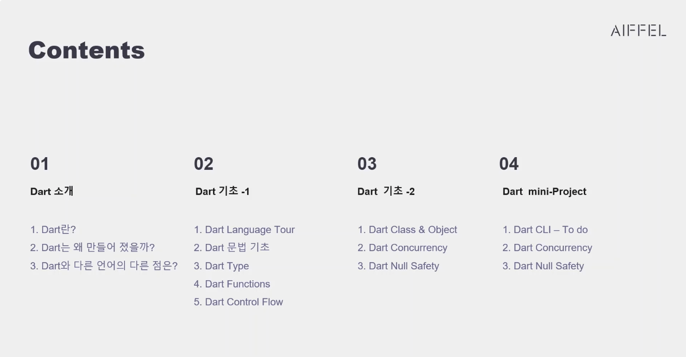
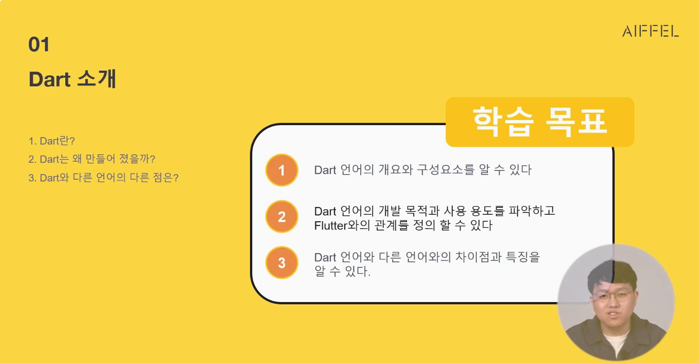
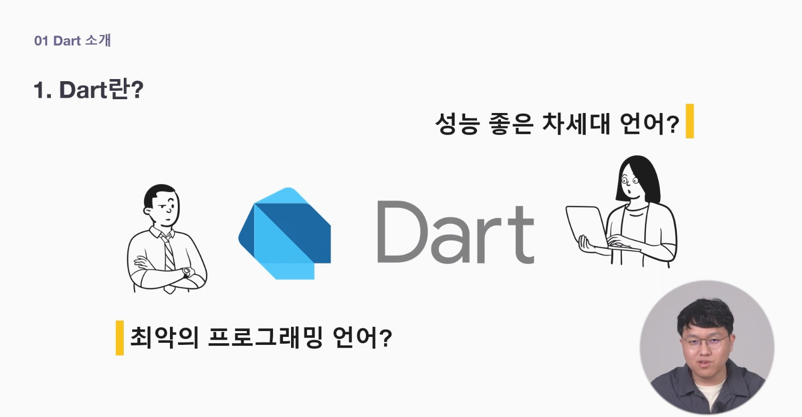
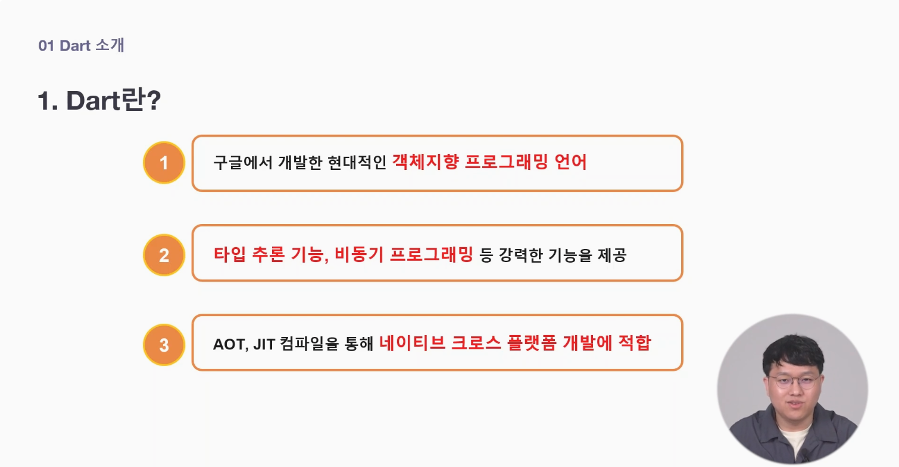
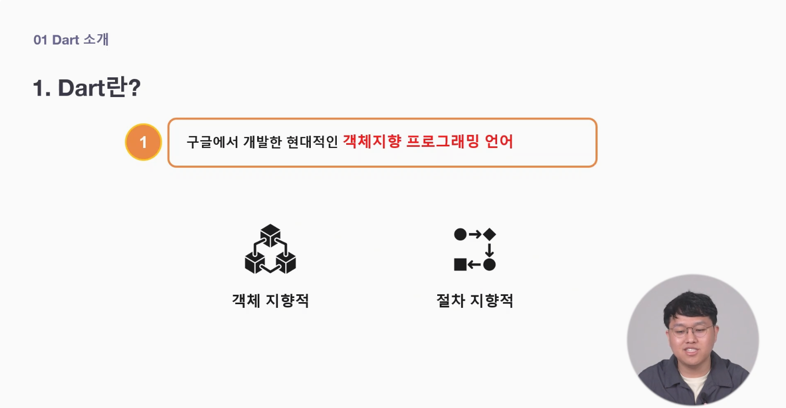
객체 지향적과 절차 지향적은 반대말
시작점부터 끝까지 순차적으로 실행하는 C언어는 절차 지향적
절차 지향적으로는 한계가 있기 때문에 여러개가 조합되어 있는 객체 지향적 프로그래밍 언어를 주로 사용하며 dart는 객체지향 언어이다.

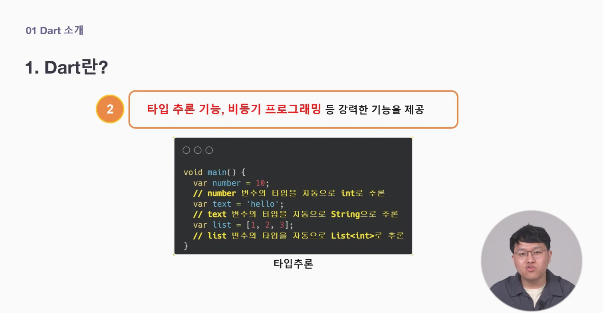
타입추론, 비동기프로그램, Null-safety 등

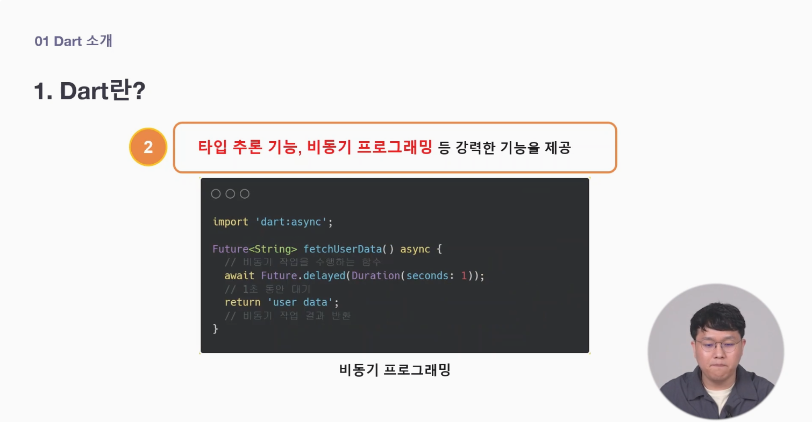

비동기 프로그래밍은 어떤 작업을 할때 다른 작업의 결과는 기다리는 식으로 작업의 효율성을 높이는 방법. 여러가지 작업을 프로그램에게 시킬 수 있다.

비동기 프로그래밍이 가능한 언어는 많지 않다.

서버로 데이터를 보내서 응답을 기다리면 오래 걸리니 다른 작업을 먼저 처리하고 응답이 오면 데이터를 처리

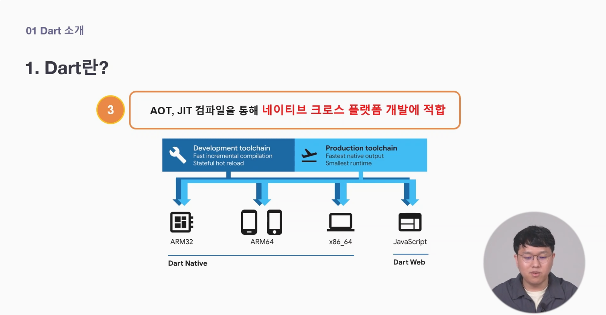

AOT(Ahead Of Time) 컴파일러는 미리 컴파일을 해서 실행파일을 만들어 놓는다. 그래서 실행할때 빠르게 실행이 가능하다. 하지만 실행파일을 만들어 놓기 때문에 용량이 커진다. 안드로이드와 스위프트에서 사용한다.

JIT(Just In Time) 컴파일러는 실행할때 컴파일을 하기 때문에 실행파일을 만들어 놓지 않는다. 주로 테스트때 빠르게 실행해서 핫리로드와 같이 사용가능

다트는 둘다 사용가능

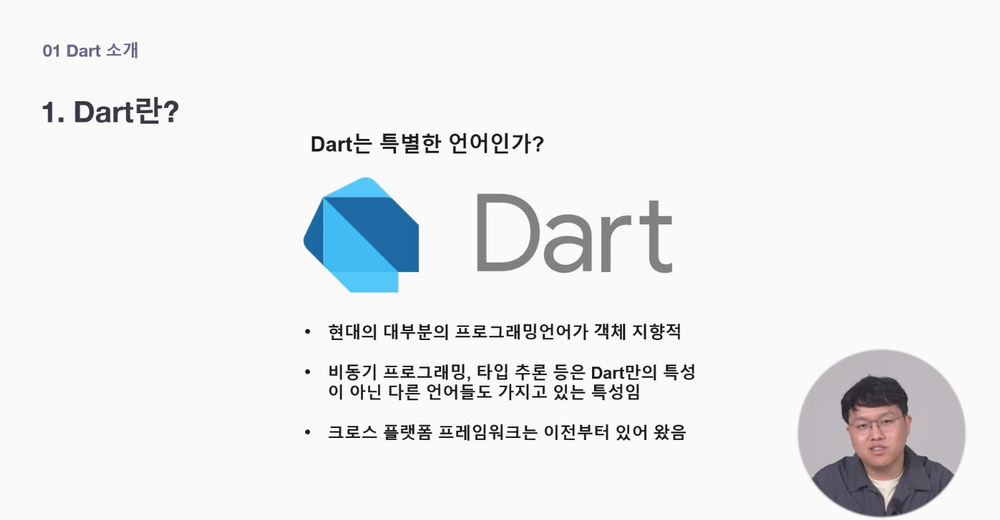

### [노트] Dart 소개 1
#### 학습 내용
---
1. Dart 소개
 - Dart란?
 - Dart는 왜 만들어졌을까?
 - Dart와 다른 언어의 다른 점은?
2. Dart 기초 실습
 - Dart Language Tour
 - Dart 문법 기초
 - Dart Type
 - Dart Functions
 - Dart Control Flow
 - Dart Class & Object
 - Dart Concurrency
 - Dart Null Safety
3. Dart To-do Project

---
#### Dart란?
구글에서 개발한 현대적인 객체지향 프로그래밍 언어입니다.

타입 추론 기능, 비동기 프로그래밍 등 강력한 기능을 제공합니다.

AOT, JIT 컴파일을 통해 네이티브 크로스 플랫폼 개발에 적합합니다.

---
## 2-2. Dart 소개 - 2

---
#### Dart는 왜 만들어졌을까?
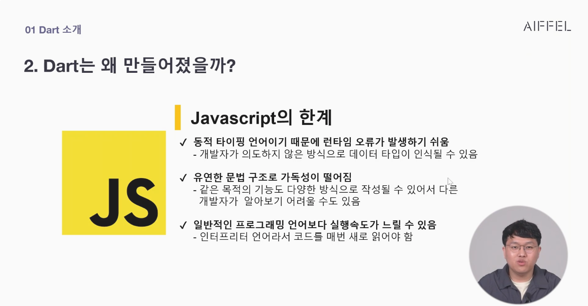
초창기 자바스크립트는 언어체계를 완벽하게 잡은 언어는 아니다.
많은 웹서비스를 감당할만큼 튼튼한 체계를 가지고 있지 않다.
동적 타이핑 언어 : 컴파일 이전 검사하는 과정을 가지지 못하기 때문에 의도치 않은 코드가 실행될지라도 자기 문법에 조금만 맞아도 오류 발생하지 않음
유연한 문법구조 : 자바스크립트는 예외 문법이 굉장히 많아서 다양한 코드를 쓸수 있기 때문에 다른사람이 짠 코드의 의도를 파악하기 어렵다.
C#, C++, Java, Python 언어에 비해 느리다. (일반적인 언어는 한번 코드를 읽으면 계속해서 코드를 읽어 작동하는데 자바는 다시 한번 코드를 읽어야 해서 조금 느리다.)

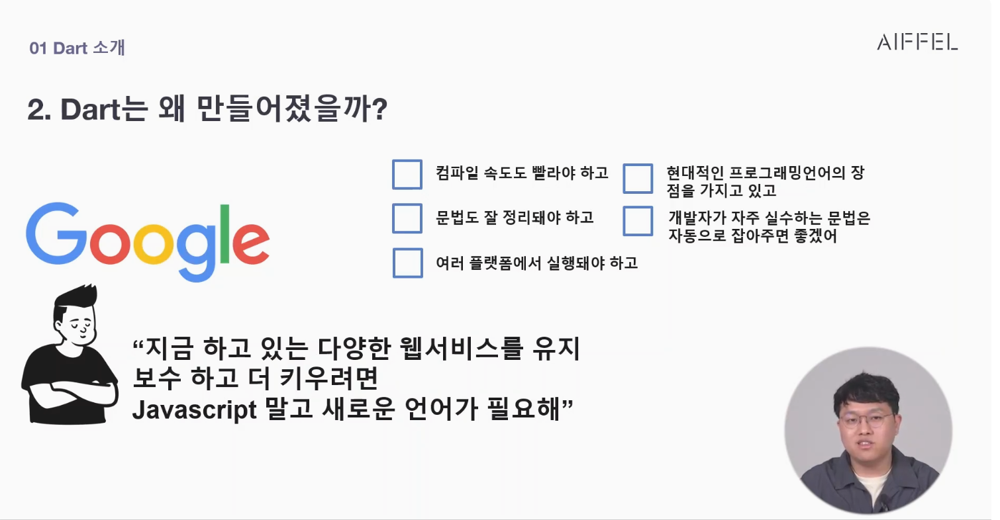
자바 이외에 단점을 해결할 수 있는 언어가 필요해 dart를 만듬.

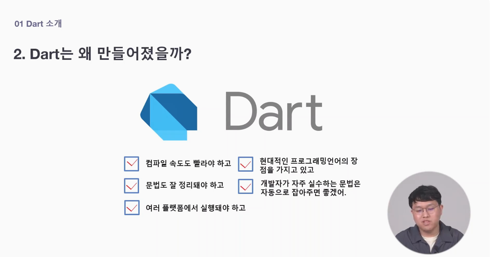
자바스크립트는 웹에서만 사용할 수 있었지만 dart는 웹, 서버, 모바일 등 다양한 플랫폼에서 사용할 수 있다.
2017년 처음 출시했을때는 할수 있는게 없어 최악의 언어로 평가받았으나 Flutter 이후 성능 좋은 언어로 평가 받음

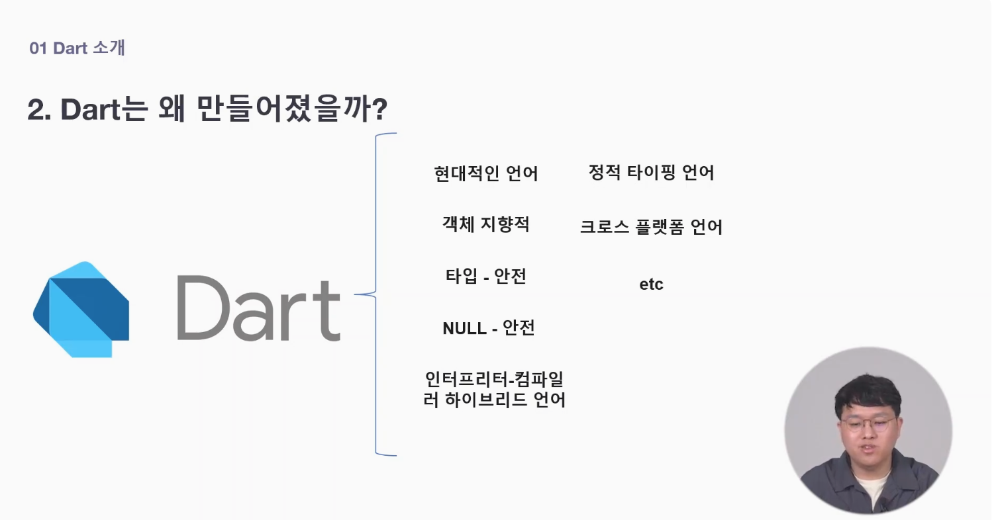

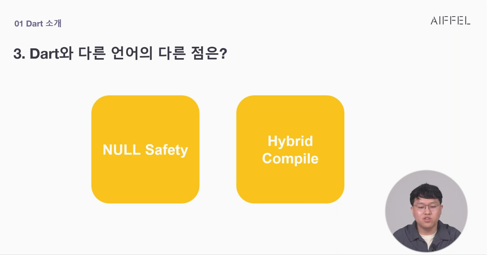

개발자가 가장 많이 하는 실수가 Null Safety 와 Type Safety 이다.


let x 는 비어있고 let y는 10이라는 값을 가지고 있다.
자바 스크립트는 null+10이라는 문자열로 출력한다. 우리가 원하는 결과는 비어있는 값은 버리고 10이라는 값을 출력하는 것이다.

타입이 서로 다르면 한쪽으로 타입을 같게 해주어야 하는 자바스크립트는 어떨때는 문자로 또 다른때는 숫자로 인식한다. 예시의 경우 문자로 출력해버린다.

널과 타입을 다루는 부분이 매우 어려운 부분이다.

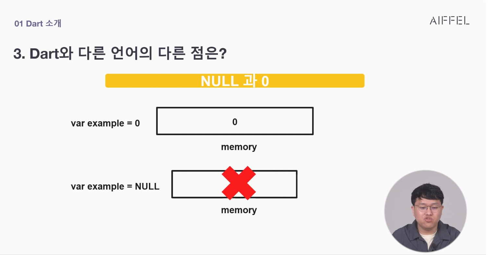
0과 Null은 다르다. 0은 값이 있고 Null은 값이 없다. 메모리 할당조차 되지 않았다는 의미
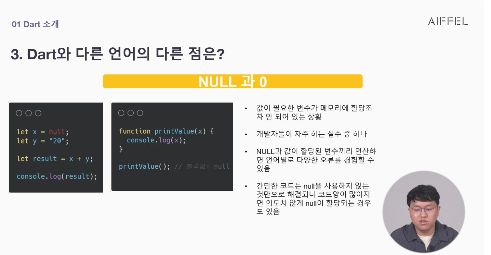

---
#### [노트 1] Dart 소개 2-1

Dart는 왜 만들어졌을까?

Dart는 Javascript가 한계를 가지기 때문에 구글에서 고안하게 되었습니다.

Javascript의 한계로는 다음의 것들이 있습니다.

동적 타이핑 언어이기 때문에 런타임 오류가 발생하기 쉬습니다.
 - 개발자가 의도하지 않은 방식으로 데이터 타입이 인식될 수 있습니다.
유연한 문법 구조로 가독성이 떨어집니다.
 - 같은 목적의 기능도 다양한 방식으로 작성될 수 있어서 다른 개발자가 알아보기 어려울 수도 있습니다.
일반적인 프로그래밍 언어보다 실행속도가 느릴 수 있습니다.
 - 인터프리터 언어라서 코드를 매번 새로 읽어야 합니다.


Dart와 다른 언어의 다른 점은?

Dart와 다른 언어의 가장 중요한 차이점으로는 NULL Safety와 Hybrid Compile이라는 특성이 있습니다.

Null Safety는 프로그래밍 언어에서 null 값에 대한 안정성과 예외 처리를 개선하는 기능입니다. Null은 값이 필요한 변수가 메모리에 할당조차 안 되어 있는 것을 의미합니다. 간단한 코드는 Null을 사용하지 않는 것만으로 해결되나 코드양이 많아지면 의도치 않게 Null이 할당되는 경우가 발생할 수 있습니다.

---
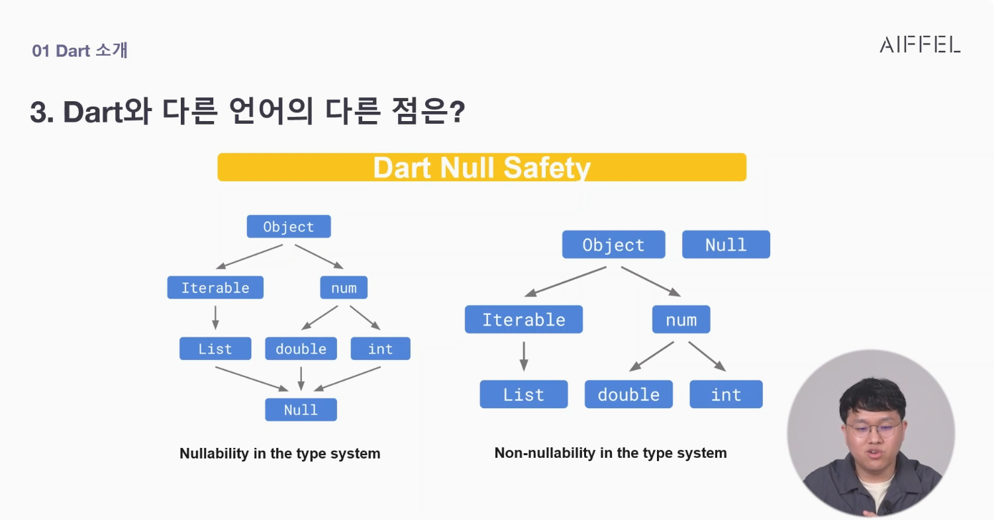

Dart는 여러 다양한 타입과 Null이 분리되어 있어 Null이 할당되는 경우를 방지할 수 있습니다.

Null을 값으로 가지려면 특수한 표식을 해야 값으로 가질 수 있다. 

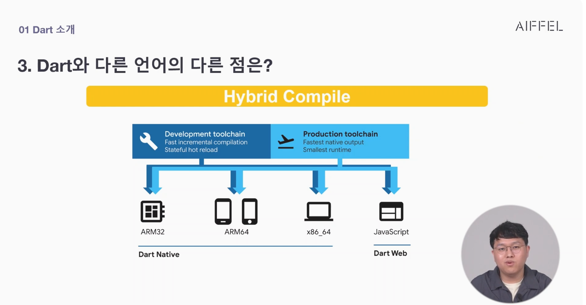

하이브리도 컴파일링이 가능하다. 하이브리드 컴파일링이란 AOT와 JIT 컴파일을 동시에 지원하는 것을 의미합니다. AOT 컴파일은 미리 컴파일을 해서 실행파일을 만들어 놓는 것이고 JIT 컴파일은 실행할 때 컴파일을 하는 것입니다. AOT 컴파일은 실행할 때 빠르게 실행이 가능하지만 실행파일을 만들어 놓기 때문에 용량이 커집니다. JIT 컴파일은 실행파일을 만들어 놓지 않기 때문에 용량은 작지만 실행할 때마다 컴파일을 해야 하기 때문에 실행 속도가 느립니다. 하이브리드 컴파일은 두 가지를 동시에 지원하기 때문에 빠른 실행 속도와 용량을 모두 만족할 수 있습니다.


JIT : 컴파일러가 그때그때 코드를 읽고 있는것. 프로그램 전체 실행의 개념에서 보면 코드를 실행할때마다 코드를 전부다 읽기 때문에 실행속도가 느리다. 컴파일이 느린것과 실행속도가 느린것은 다르다.

AOT : 코드를 한번에 다 읽어서 프로그램이 실행되는데 기계어 바이너리 명령어가 할당이 다 되어 있어 다시 읽지 않아도 된다.

JIS는 개발할때, AOT는 프로그램이 실제 실행되고 작동될때 편하다. 

다트는 두가지가 다 가능하기 때문에 개발과정에서 코드에 따른 변화를 눈으로 볼수 있고 실제 실행파일로 묶어져서 나온다음에도 성능을 그대로 유지할 수 있다.

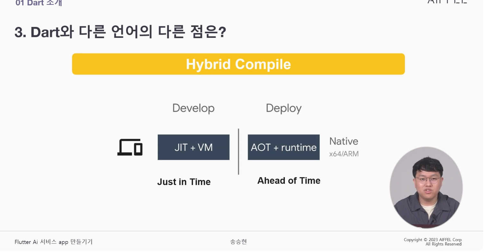

개발할때는 JIT과 가상머신위에서 프로그램이 들어가고 배포하고 나서는 native한 환경에서 AOT 컴파일로 돌아가서 실행파일 작동한다.

개발환경과 배포환경에서 모두 속도가 떨어지지 않는다.

---
[노트 2] Dart 소개 2-1
Hybrid Compile은 Dart 코드를 다른 프로그래밍 언어로 변환하여 실행할 수 있는 기술을 말합니다. 상황에 따라 Javascript로 변환되어 웹 브라우저에서 실행될 수도 있고, Flutter를 활용하여 Dart 코드를 네이티브 코드로 변환하여 모바일 앱에서 실행될 수도 있습니다.


---
## 2-3. Dart 기초 실습 - 1

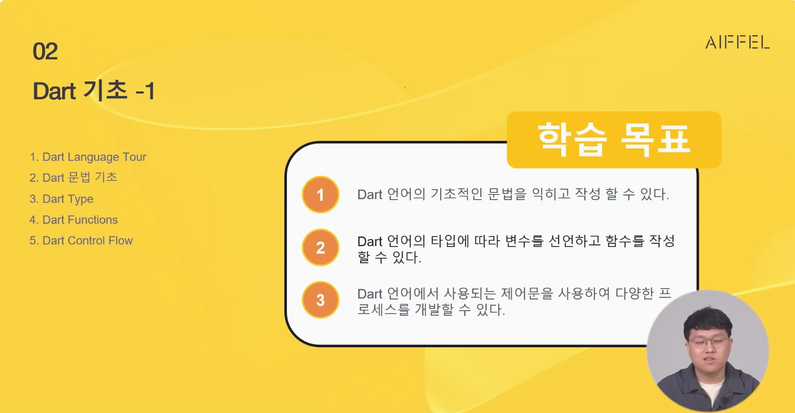
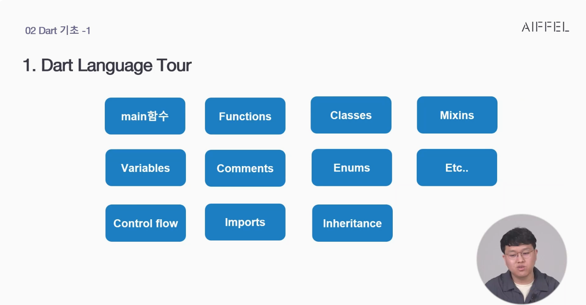
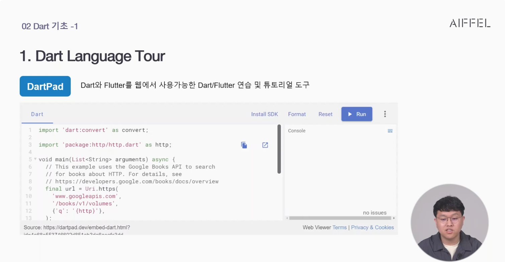
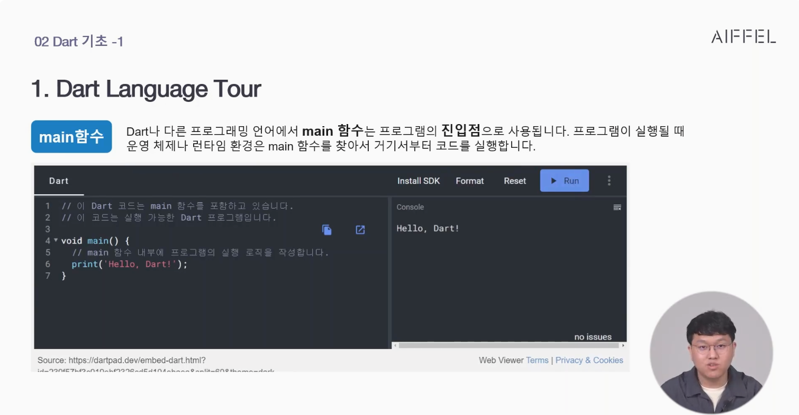
main 함수는 모든 함수의 시작점. 없으면 실행이 되지 않고 에러가 난다.
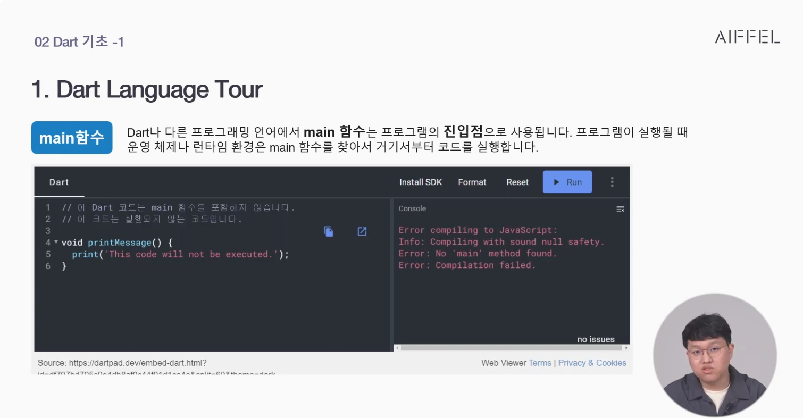
main 함수는 꼭 적어야 한다.

---
### [실습 1] Dart 기초 실습 1-1
Dart Language Tour
🔶 main 함수
Dart나 다른 프로그래밍 언어에서 main 함수는 프로그램의 진입점으로 사용됩니다. 프로그램이 실행될 때 운영 체제나 런타임 환경은 main 함수를 찾아서 거기서부터 코드를 실행합니다.

```dart
// 이 Dart 코드는 main 함수를 포함하고 있습니다.
// 이 코드는 실행 가능한 Dart 프로그램입니다.

void main() {
  // main 함수 내부에 프로그램의 실행 로직을 작성합니다.
  print('Hello, Dart!');
}
```
```console
Hello, Dart!
```

---

```dart
// 이 Dart 코드는 main 함수를 포함하지 않습니다.
// 이 코드는 실행되지 않는 코드입니다.

void printMessage() {
  print('This code will not be executed.');
}
```
```console
Error compiling to JavaScript:
Error: No 'main' method found.
Error: Compilation failed
```
---
### [영상 2] Dart 기초 실습 1-2

---
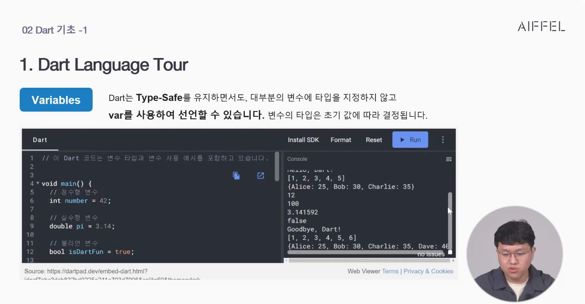
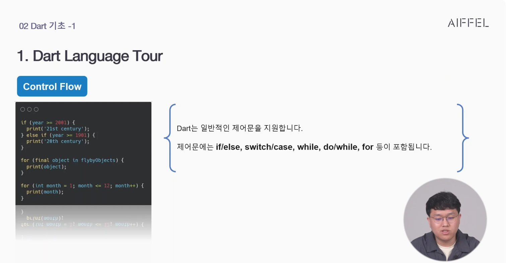
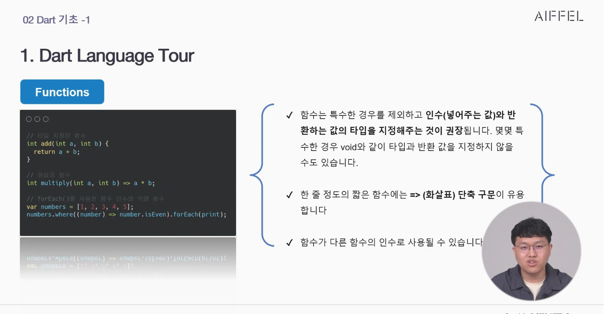
---
### [실습 2] Dart 기초 실습 1-2
🔶 Variables
Dart는 Type-Safe를 유지하면서도, 대부분의 변수에 타입을 지정하지 않고 var를 사용하여 선언할 수 있습니다. 변수의 타입은 초기 값에 따라 결정됩니다.

---
```dart
// 이 Dart 코드는 변수 타입과 변수 사용 예시를 포함하고 있습니다.

void main() {
  // 정수형 변수
  int number = 42;
  
  // 실수형 변수
  double pi = 3.14;
  
  // 불리언 변수
  bool isDartFun = true;
  
  // 문자열 변수
  String greeting = 'Hello, Dart!';
  
  // 리스트 변수
  List<int> numbers = [1, 2, 3, 4, 5];
  
  // 맵 변수
  Map<String, int> ages = {
    'Alice': 25,
    'Bob': 30,
    'Charlie': 35,
  };
  
  // 변수 출력
  print(number);
  print(pi);
  print(isDartFun);
  print(greeting);
  print(numbers);
  print(ages);
  
  // 변수 값 변경
  number = 100;
  pi = 3.141592;
  isDartFun = false;
  greeting = 'Goodbye, Dart!';
  numbers.add(6);
  ages['Dave'] = 40;
  
  // 변경된 변수 출력
  print(number);
  print(pi);
  print(isDartFun);
  print(greeting);
  print(numbers);
  print(ages);
}
```
```console
42
3.14
true
Hello, Dart!
[1, 2, 3, 4, 5]
{Alice: 25, Bob: 30, Charlie: 35}
100
3.141592
false
Goodbye, Dart!
[1, 2, 3, 4, 5, 6]
{Alice: 25, Bob: 30, Charlie: 35, Dave: 40}
```

---
🔶 Control Flow

Dart는 일반적인 제어문을 지원합니다. 제어문에는 if/else, switch/case, while, do/while, for 등이 포함됩니다.

```dart
// 이 Dart 코드는 제어문 예시를 포함하고 있습니다.


void main() {
  // if-else 문: 조건에 따라 코드 실행 여부 결정
  int number = 42;
  if (number > 50) {
    print('number is greater than 50');
  } else {
    print('number is less than or equal to 50');
  }
  
  // switch-case 문: 다중 분기 처리
  String fruit = 'apple';
  switch (fruit) {
    case 'apple':
      print('This is an apple');
      break;
    case 'banana':
      print('This is a banana');
      break;
    default:
      print('This is not a fruit');
  }
  
  // for-in 문: 리스트나 맵의 모든 항목에 대해 반복
  List<int> numbers = [1, 2, 3, 4, 5];
  for (int number in numbers) {
    print(number);
  }
  
  // while 문: 조건이 참인 동안 코드 반복 실행
  int count = 0;
  while (count < 5) {
    print(count);
    count++;
  }
  
  // do-while 문: 코드를 최소한 한번 실행하고, 조건이 참인 동안 반복 실행
  int i = 0;
  do {
    print(i);
    i++;
  } while (i < 3);
}
```
```console
number is less than or equal to 50
This is an apple
1
2
3
4
5
0
1
2
3
4
0
1
2
```

---
🔶 Functions

함수는 특수한 경우를 제외하고 인수(넣어주는 값)와 반환하는 값의 타입을 지정해주는 것이 권장됩니다. 몇몇 특수한 경우 void와 같이 타입과 반환 값을 지정하지 않을 수도 있습니다. 간단한 함수는 =>(화살표) 단축 구문으로 만들 수도 있으며, 함수가 다른 함수의 인수로 사용될 수도 있습니다.

```dart
void main() {
    // 타입 지정된 함수
    int add(int a, int b) {
        return a + b;
    }

    // 화살표 함수
    int multiply(int a, int b) => a * b;

    // forEach()를 사용한 함수 인수와 익명 함수
    var numbers = [1, 2, 3, 4, 5];
    numbers.where((number) => number.isEven).forEach(print);
}
```

---
### 2-4. Dart 기초 실습 - 2

---
#### [영상 1] Dart 기초 실습 2-1

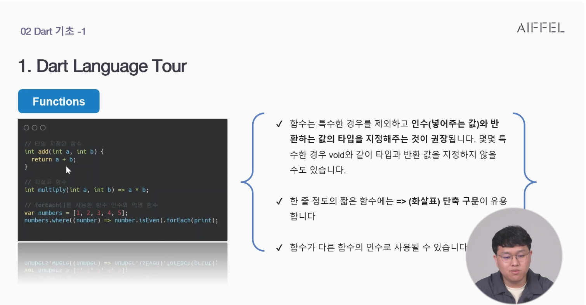
void는 반환값이 없다는 의미이다.

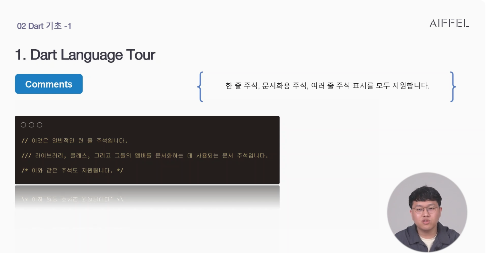
/*, */는 여러줄 주석이다.

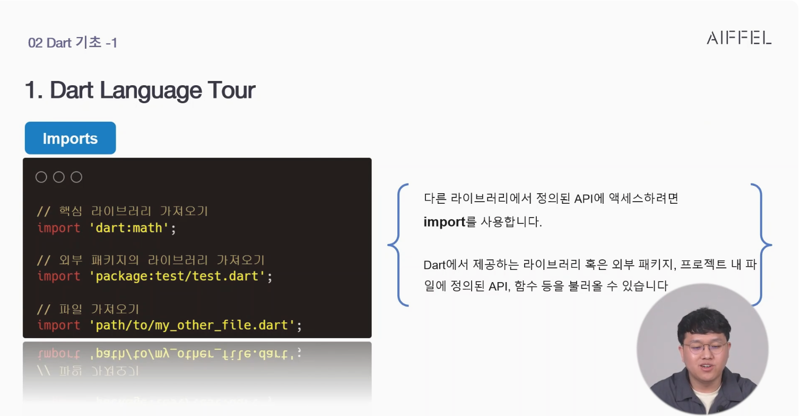

---
### [실습 1] Dart 기초 실습 2-1

🔶 Functions

함수는 특수한 경우를 제외하고 인수(넣어주는 값)와 반환하는 값의 타입을 지정해주는 것이 권장됩니다. 몇몇 특수한 경우 void와 같이 타입과 반환 값을 지정하지 않을 수도 있습니다. 간단한 함수는 =>(화살표) 단축 구문으로 만들 수도 있으며, 함수가 다른 함수의 인수로 사용될 수도 있습니다.

```dart
void main() {
    // 타입 지정된 함수
    int add(int a, int b) {
        return a + b;
    }

    // 화살표 함수
    int multiply(int a, int b) => a * b;

    // forEach()를 사용한 함수 인수와 익명 함수
    var numbers = [1, 2, 3, 4, 5];
    numbers.where((number) => number.isEven).forEach(print);
}
```

---
```dart
// 이 Dart 코드는 함수 선언과 함수 사용 예시를 포함하고 있습니다.

void main() {
  // 함수 호출
  printMessage('Hello, Dart!');
  
  // 함수 호출과 반환값 사용
  int result = addNumbers(3, 5);
  print('3 + 5 = $result');
  
  // 선택적 매개변수 사용
  showInfo('Alice');
  showInfo('Bob', age: 30);
  
  // 위치 기반 매개변수 사용
  printInfo('Charlie', 35);
}

// 함수 선언: 인자 없는 함수
void printMessage(String message) {
  print(message);
}

// 함수 선언: 인자 두 개를 받아 더한 결과를 반환하는 함수
int addNumbers(int a, int b) {
  return a + b;
}

// 함수 선언: 선택적 매개변수를 사용하는 함수
void showInfo(String name, {int? age}) {
  print('Name: $name');
  if (age != null) {
    print('Age: $age');
  }
}

// 함수 선언: 위치 기반 매개변수를 사용하는 함수
void printInfo(String name, int age) {
  print('Name: $name');
  print('Age: $age');
}
```
```console
Hello, Dart!
3 + 5 = 8
Name: Alice
Name: Bob
Age: 30
Name: Charlie
Age: 35
```

---
🔶 Comments

한 줄 주석, 문서화용 주석, 여러 줄 주석 표시를 모두 지원합니다.

```dart
// 이것은 일반적인 한 줄 주석입니다.

/// 라이브러리, 클래스, 그리고 그들의 멤버를 문서화하는 데 사용되는 문서 주석입니다.

/* 이와 같은 
여러 줄 주석도 
지원됩니다. */
```

---
🔶 Imports

다른 라이브러리에서 정의된 API에 액세스하려면 import를 사용합니다. Dart에서 제공하는 라이브러리 혹은 외부 패키지, 프로젝트 내 파일에 정의된 API, 함수 등을 불러올 수 있습니다.

```dart
// 핵심 라이브러리 가져오기
import 'dart:math';

// 외부 패키지의 라이브러리 가져오기
import 'package:test/test.dart';

// 파일 가져오기
import 'path/to/my_other_file.dart';
```

---
### [영상 2] Dart 기초 실습 2-2

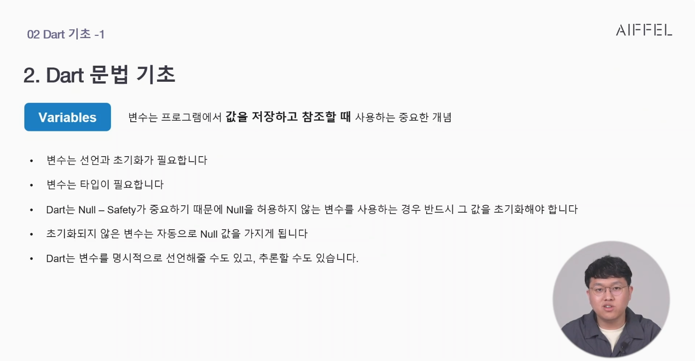
초기화되지 않은 변수는 값을 가져야 한다.
var 변수는 null 값을 가질수 있지만 int 변수는 null 값을 가질 수 없다.

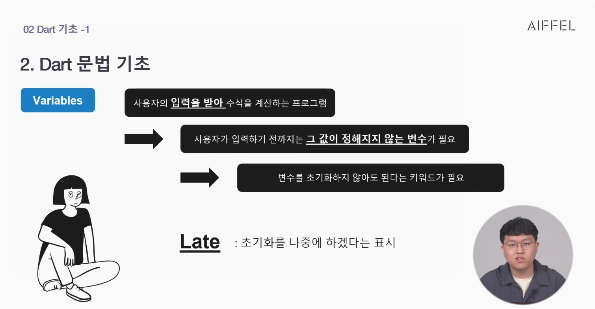
언젠가 값이 들어올테니 null이 아니라고 알려주는 것이 필요한데 이것이 late 키워드이다.
late는 변수를 작성할때 쓴다.


final과 const 차이는 final은 런타임에 값이 결정되고 const는 컴파일 타임에 값이 결정된다.

final과 const는 값을 재할당하는 것이 불가능하다.

---
### [실습 2] Dart 기초 실습 2-2

#### Dart 문법 기초

🔶 Variables

변수는 프로그램에서 값을 저장하고 참조할 때 사용하는 중요한 개념입니다.

 - 변수는 선언과 초기화가 필요합니다.
 - 변수는 타입이 필요합니다.
 - Dart는 Null - Safety가 중요하기 때문에 Null을 허용하지 않는 변수를 사용하는 경우 반드시 그 값을 초기화해야 합니다.
 - 초기화되지 않은 변수는 자동으로 Null 값을 가지게 됩니다.
 - Dart는 변수를 명시적으로 선언해줄 수도 있고, 추론할 수도 있습니다.

```dart
// 변수 선언과 초기화
var name = 'Bob';

// 변수 타입 지정
Object objName = 'Bob';

// 변수 타입 지정 (명시적으로)
String strName = 'Bob';

// final 변수 선언
final finalName = 'Bob';

// const 변수 선언
const bar = 1000000;
const double atm = 1.01325 * bar;
const baz = [];

void main() {
  print(name); // 'Bob' 출력
  print(objName); // 'Bob' 출력
  print(strName); // 'Bob' 출력
  print(finalName); // 'Bob' 출력
  print(baz); // [] 출력
  
}
```
```console
Bob
Bob
Bob
Bob
[]
```

---
late : 초기화를 나중에 하겠다는 표시를 하는 역할을 합니다.

```dart
class Person {
  late String name;

  void sayHello() {
    print('Hello, my name is $name');
  }
}

void main() {
  var person = Person();
  person.name = 'Alice';
  person.sayHello();
}
```
```console
Hello, my name is Alice
```

---
final : 한 번 값을 할당하면 변경이 불가능한 키워드 이며, 초기화 후 값을 변경할 수 없습니다.

const : 한 번 값을 할당하면 변경이 불가능한 키워드 이며, 값을 변경할 수 없습니다.

Dart에서 final과 const의 세부적인 차이는 다음 링크를 확인해주세요.

https://couldi.tistory.com/33

```dart
import 'dart:math';

void main() {
  // final 변수
  final int finalValue = Random().nextInt(10);
  print("finalValue: $finalValue");

  // const 변수
  const int constValue = 5;
  print("constValue: $constValue");
  
  // final 변수 재할당 (오류)
  // finalValue = 10;

  // const 변수 재할당 (오류)
  // constValue = 10;

  // final 변수 변경
  final int finalNewValue = finalValue + 5;
  print("finalNewValue: $finalNewValue");

  // const 변수 변경 (오류)
  // const int constNewValue = constValue + 5;
}
```
```console
finalValue: 3
constValue: 5
finalNewValue: 8
```

---
[영상/실습 3] Dart 기초 영상/실습 2-3


조건 연산자는 코드를 짧게 쓰기 위해서 사용한다.


```dart
void main() {
  // 산술 연산자
  int a = 10;
  int b = 5;
  print("a + b = ${a + b}"); // 더하기
  print("a - b = ${a - b}"); // 빼기
  print("a * b = ${a * b}"); // 곱하기
  print("a / b = ${a / b}"); // 나누기
  print("a % b = ${a % b}"); // 나머지

  // 비교 연산자
  print("a > b : ${a > b}");
  print("a < b : ${a < b}");
  print("a >= b : ${a >= b}");
  print("a <= b : ${a <= b}");
  print("a == b : ${a == b}");
  print("a != b : ${a != b}");

  // 논리 연산자
  bool x = true;
  bool y = false;
  print("x && y : ${x && y}");
  print("x || y : ${x || y}");
  print("!x : ${!x}");

  // 할당 연산자
  int c = 5;
  c += 3; // c = c + 3;
  print("c : $c");
  c -= 2; // c = c - 2;
  print("c : $c");
  c *= 4; // c = c * 4;
  print("c : $c");
  c ~/= 3; // c = c ~/ 3;
  print("c : $c");
  c %= 2; // c = c % 2;
  print("c : $c");

  // 증감 연산자
  int d = 7;
  d++; // d = d + 1;
  print("d : $d");
  d--; // d = d - 1;
  print("d : $d");
}

```
```console
a + b = 15
a - b = 5
a * b = 50
a / b = 2
a % b = 0
a > b : true
a < b : false
a >= b : true
a <= b : false
a == b : false
a != b : true
x && y : false
x || y : true
!x : false
c : 8
c : 6
c : 24
c : 8
c : 0
d : 8
d : 7
```

---
🔶 Keyword

키워드란 Dart 언어에서 특별히 취급하는 단어입니다.


키워드는 변수나 함수로 사용할 수 없다.

---

### [영상/실습 4] Dart 기초 영상/실습 2-4

#### Dart Type

```dart
void main() {
  // Numbers
  int a = 10;
  double b = 3.14;
  num c = 1; // num can be either int or double
  print("Numbers:");
  print("a: $a, b: $b, c: $c");

  // Strings
  String name = "John";
  String greeting = 'Hello, $name!';
  String multiLine = '''
    This is a multi-line string.
    It can cover multiple lines.
    ''';
  print("\nStrings:");
  print("name: $name");
  print("greeting: $greeting");
  print("multiLine: $multiLine");

  // Booleans
  bool isTrue = true;
  bool isFalse = false;
  print("\nBooleans:");
  print("isTrue: $isTrue");
  print("isFalse: $isFalse");

  // Lists
  List<int> numbers = [1, 2, 3];
  List<String> fruits = ["apple", "banana", "orange"];
  print("\nLists:");
  print("numbers: $numbers");
  print("fruits: $fruits");

  // Sets
  Set<int> numberSet = {1, 2, 3};
  Set<String> fruitSet = {"apple", "banana", "orange"};
  print("\nSets:");
  print("numberSet: $numberSet");
  print("fruitSet: $fruitSet");

  // Maps
  Map<String, int> ages = {"John": 30, "Jane": 25};
  Map<String, String> colors = {"apple": "red", "banana": "yellow", "orange": "orange"};
  print("\nMaps:");
  print("ages: $ages");
  print("colors: $colors");

  // Runes
  Runes input = new Runes('\u{1f600}');
  String smiley = String.fromCharCodes(input);
  print("\nRunes:");
  print("smiley: $smiley");

  // Symbols
  Symbol s = #test;
  print("\nSymbols:");
  print(s);
}
```
```console
Numbers:
a: 10, b: 3.14, c: 1

Strings:
name: John
greeting: Hello, John!
multiLine:     This is a multi-line string.
    It can cover multiple lines.
    

Booleans:
isTrue: true
isFalse: false

Lists:
numbers: [1, 2, 3]
fruits: [apple, banana, orange]

Sets:
numberSet: {1, 2, 3}
fruitSet: {apple, banana, orange}

Maps:
ages: {John: 30, Jane: 25}
colors: {apple: red, banana: yellow, orange: orange}

Runes:
smiley: 😀

Symbols:
Symbol("test")
```

---
#### Dart Functions


변수랑 함수를 연산할때 함수를 객체처럼 변수에 할당해서 연산할 수 있다.

다트의 함수가 일급객체이기 때문에 가능하다.

```dart
// 메인 함수: 프로그램의 시작점입니다.
void main() {
  // 두 수를 더하는 함수 호출
  int result = add(5, 3);
  print('5 + 3 = $result');
}

// 두 정수를 더하는 함수입니다.
int add(int a, int b) {
  return a + b;
}
```
```console
5 + 3 = 8
```

---
#### Control Flow

```dart
void main() {
  int number = 42;

  // if-else 문을 사용하여 짝수인지 홀수인지 판별합니다.
  if (number % 2 == 0) {
    print('$number 는 짝수입니다.');
  } else {
    print('$number 는 홀수입니다.');
  }

  // for 반복문을 사용하여 1부터 5까지의 합을 계산합니다.
  int sum = 0;
  for (int i = 1; i <= 5; i++) {
    sum += i;
  }
  print('1부터 5까지의 합: $sum');

  // while 반복문을 사용하여 1부터 10까지의 곱을 계산합니다.
  int product = 1;
  int i = 1;
  while (i <= 10) {
    product *= i;
    i++;
  }
  print('1부터 10까지의 곱: $product');

  // switch 문을 사용하여 월별 일수를 출력합니다.
  int month = 2;
  int year = 2023;
  int days;

  switch (month) {
    case 1:
    case 3:
    case 5:
    case 7:
    case 8:
    case 10:
    case 12:
      days = 31;
      break;
    case 4:
    case 6:
    case 9:
    case 11:
      days = 30;
      break;
    case 2:
      if (year % 4 == 0 && (year % 100 != 0 || year % 400 == 0)) {
        days = 29;
      } else {
        days = 28;
      }
      break;
    default:
      days = 0;
      print('올바른 월이 아닙니다.');
  }

  if (days != 0) {
    print('$year 년 $month 월은 $days 일까지 있습니다.');
  }
}
```
```console
42 는 짝수입니다.
1부터 5까지의 합: 15
1부터 10까지의 곱: 3628800
2023 년 2 월은 28 일까지 있습니다.
```

---
### 연습문제

```dart
class Calculator {
  // 두 정수를 더하는 함수입니다.
  int add(int a, int b) {
    return a + b;
  }
  // 두 정수를 빼는 함수입니다.
  int subtract(int a, int b) {
    return a - b;
  }
  // 두 정수를 곱하는 함수입니다.
  int multiply(int a, int b) {
    return a * b;
  }
  // 두 정수를 나누는 함수입니다.
  double divide(int a, int b) {
    return a / b;
  }
}

void main() {
  Calculator calculator = Calculator();
  print(calculator.add(5, 3));
  print(calculator.subtract(5, 3));
  print(calculator.multiply(5, 3));
  print(calculator.divide(5, 3));
}
```
```console
8
2
15
1.6666666666666667
```

---
### 2-5. Dart 기초 실습 - 3

#### [영상 1] Dart 기초 실습 3-1

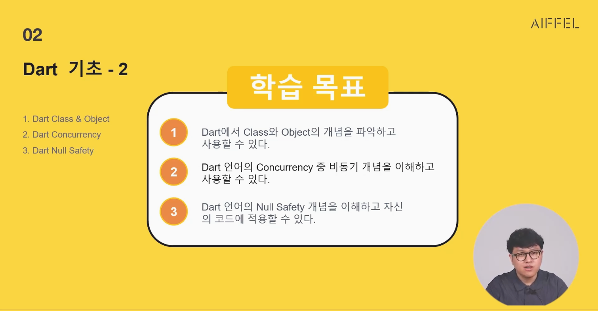
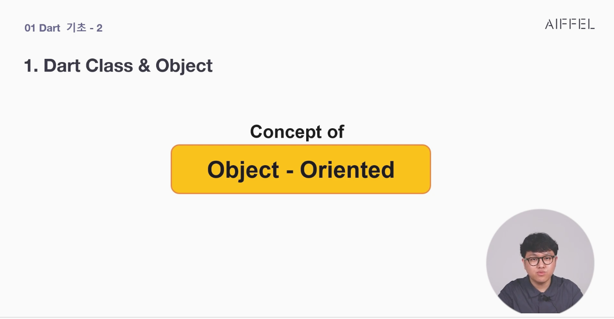
객체지향의 반대는 절차지향
절차지향의 경우 코드 중간에 문제 발생시 코드 전체를 검토해야 함.
객체지향은 각각의 객체들이 따로 일을 하고 이것을 모아서 결과를 도출함. 모듈화와 같은 의미.

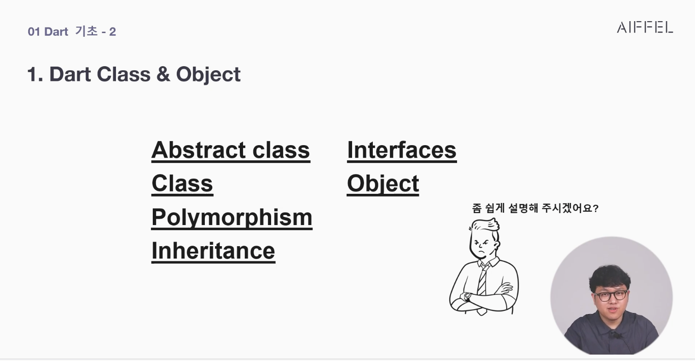
추상클래스, 클래스, 다형성, 상속성, 인터페이스와 오브젝 라는 개념들이 적용된 언어를 객체지향적인 언어라고 표현함

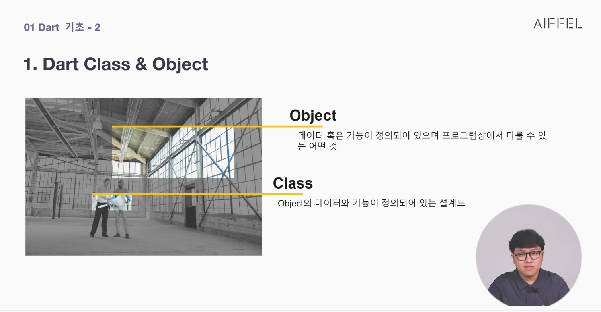

Dart Class & Object

🔶 Class의 구성요소

클래스는 보통 대문자로 시작함.
클래스 멤버는 클래스에 속한 데이터와 함수(인스턴스라 함)
클래스 컨스트럭터(혹은 생성자)는 기초설계, 프로그래밍할때 이 클래스는 이런 데이터를 가지고 시작해라 라는 의미.

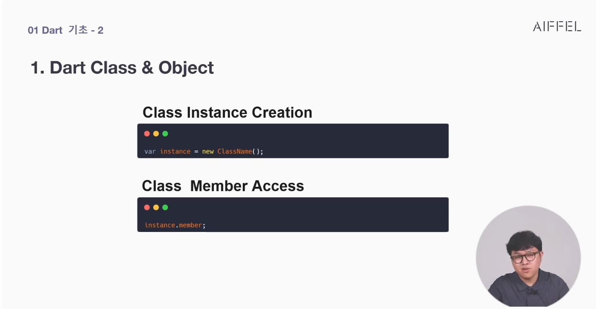
위와 같은 방식으로 인스턴스 뒤에 .을 찍어 클래스에 미리 정의 데이터와 기능을 사용할수 있게 된다.

---
#### [영상/실습 2] Dart 기초 영상/실습 3-2

```dart
//다음의 함수가 실행될 수 있도록 Class Person을 작성하시오

// 추가된 부분
class Person{
  var name;
  var age;

  Person(this.name, this.age);

  void printInfo(){
    print('name : $name , age : $age');
  }
}
//추가된 작성분 끝

void main() {
  var person = Person('John Doe', 30);
  person.printInfo();

  var person2 = Person('ralph',30);
  person2.printInfo();

}
```
```console
name : John Doe , age : 30
name : ralph , age : 30
```
🔶 Inheritance & Polymorphism


똑같은 기능을 이어받는 것을 상속이라고 함.(Inheritance)

이어 받아서 기능을 추가하는 것을 다형성이라고 함.(Polymorphism)

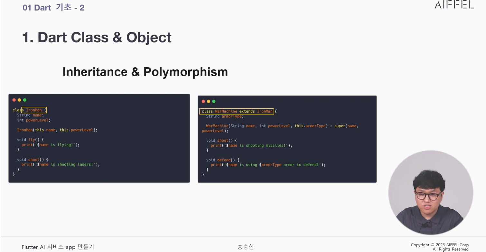

상속 및 다형성 예시

```dart
class IronMan{
  String name;
  int powerLevel;

  IronMan(this.name, this.powerLevel);

  void fly(){
    print('$name is flying!');
  }
  void shootLaser(){
    print('$name is shooting laser!');
  }
}

class WarMachine extends IronMan{
  String armorType;

  WarMachine(String name, int powerLevel,this.armorType): super(name, powerLevel);

  void shootLaser(){
    print('$name is shooting missiles!');
  }

  void Defend(){
    print('$name is using $armorType armor to defend!');
  }
}
```
---
### [영상 3] Dart 기초 실습 3-3

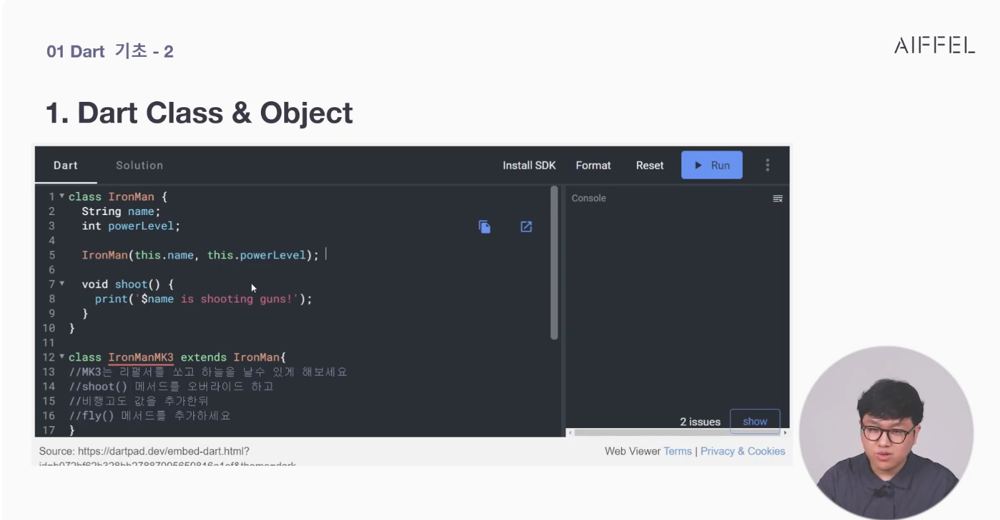
this : 자기 자신을 가리키는 키워드
this의 목적은 코드를 짤때 매개변수의 name을 알려주는 역할
클래스 안에 우리가 선언한 name을 사용하겠다는 의미

```dart
class IronMan {
  String name;
  int powerLevel;

  IronMan(this.name, this.powerLevel);

  void shoot() {
    print('$name is shooting guns!');
  }
}

class IronManMK3 extends IronMan{
//MK3는 리펄서를 쏘고 하늘을 날수 있게 해보세요
//shoot() 메서드를 오버라이드 하고
//비행고도 값을 추가한뒤
//fly() 메서드를 추가하세요
  var flyheight;

  IronManMK3(String name, int powerLevel, this.flyheight): super(name, powerLevel);
  //super는 부모 클래스를 의미함.위에서 부터 받았다는 의미(IronMan에서 받은 그대로 사용하겠다는 의미로 외부에서 왔기 때문에 this를 사용하지 않음)
  //this는 내부에서 선언한 것을 사용하겠다는 의미

  //오버라이드: 부모 클래스에서 받은 것을 재정의 하는 것
  //기존의 shoot에 새로운 내용을 덮어 쓴다.
  @override
  void shoot() {
    print('$name is shooting Laser!');
  }
  void fly(){
    print('$name is flying at $flyheight');
  }
}

void main(){

  IronMan mk1 = IronMan("mk1", 10);

  IronManMK3 mk3 = IronManMK3("mk3",20,1000);

  mk1.shoot();

  mk3.shoot();

  mk3.fly();
}
```


```console
mk1 is shooting guns!
mk3 is shooting Laser!
mk3 is flying at 1000
```

---
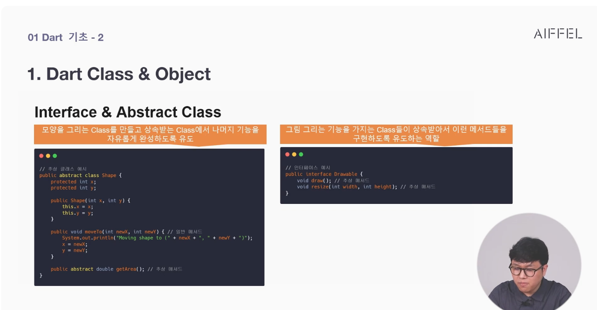

🔶 Interface & Abstract Class

추상 메서드는 아직 완성되지 않음을 의미. 아직 선언만 하고 안만든 상태. 나중에 완성은 다른 사람에게 시킴

각각 필요한 곳에서 그때그때 구현해서 써라와 같은 설계도를 의미함.

추상클래스는 상속받아서 똑같이 만들어라는 의미

인터페이스는 클래스의 청사진. 세부적인 기능은 구현하지 않고 클래스의 이름과 메서드만을 정의함.

Dart 언어는 Interface를 사용하지 않습니다.

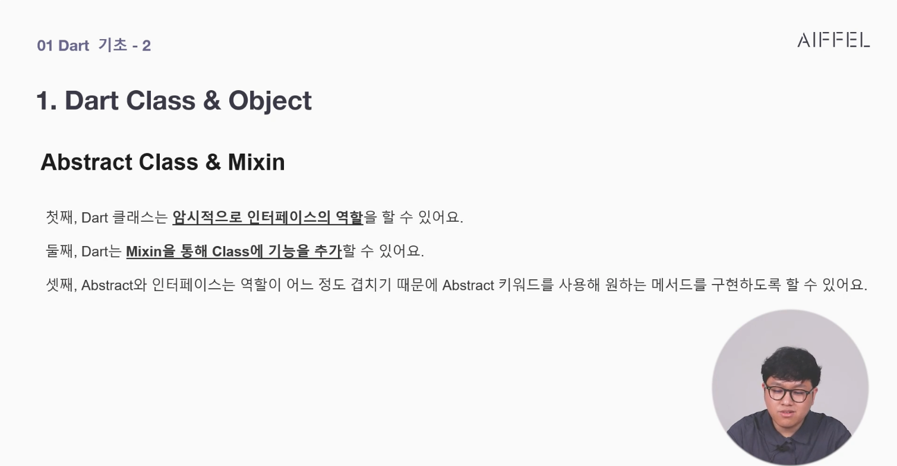

🔶 Abstract Class & Mixin

Dart class는 암시적으로 인터페이스의 역할을 할 수 있습니다.

Dart는 Mixin을 통해 class에 기능을 추가할 수 있습니다. (클래스A와 클래스 B를 섞어서 새로운 기능을 하는 클래스 추가. 한쪽에 추상적이거나 인터페이스처럼 선언하면 mixin 을 이용해 인터페이스처럼 사용할 수 있다)

Abstract와 인터페이스는 역할이 어느 정도 겹치기 때문에 Abstract 키워드를 사용해 원하는 메서드를 구현하도록 할 수 있습니다.

---
### [영상/실습 4] Dart 기초 영상/실습 3-4

🔶 Abstract Class 실습

```dart
//추상클래스를 사용하여 IronMan Class에 method를 구현하기 
class A{
  var age;
  var name;
  
  A(this.name, this.age);
  void speak() // 'speak' must have a method body because 'A' isn't abstract. 오류 발생
// abstract가 아니라 이런식으로 표현할 수 없음

}
//추상클래스를 사용하여 IronMan Class에 method를 구현하기

abstract class IronMan {
  var name;
  var suitColor;

  IronMan(this.name, this.suitColor);

  // This is an abstract method. It must be implemented by subclasses.
  void fly();

  // This is an abstract method. It must be implemented by subclasses.
  void shootLasers();

  // This is an abstract method. It must be implemented by subclasses.
  void withstandDamage();
}

//@override 구문을 사용하여 abstract method 구현
class Mark50 extends IronMan {
  Mark50(String name, String suitColor) : super(name, suitColor);

  @override
  void fly() {
    print('$name is Flying!');
  }

  @override
  void shootLasers() {
    print('$name is Lasers fired!');
  }

  @override
  void withstandDamage() {
    print('$name is Damage taken!');
  }
}

void main() {
  var mark50 = Mark50('Mark-50', 'Red and Gold');

  mark50.fly();
  mark50.shootLasers();
  mark50.withstandDamage();
}
```
```console
Mark-50 is Flying!
Mark-50 is Lasers fired!
Mark-50 is Damage taken!
```

---
🔶 mixin 실습

```dart
mixin Flyable on Animal { // Animal 클래스를 상속받는(extend) Flyable 클래스
  void fly() {
    print('I am flying!');
  }
}

class Animal {
  String name;

  Animal(this.name);
}
// 다중 상속 - dart는 다중 상속을 지원하지 않지만 mixin을 통해 다중 상속과 비슷한 효과를 낼 수 있습니다.
class Bird extends Animal with Flyable {
  // Bird는 Animal의 모든 속성과 메소드를 가지며,
  // Flyable mixin에서 제공하는 fly() 메소드도 가지고 있다.

  Bird(String name) : super(name);
}

void main() {
  var bird = Bird('Bird'); // "Bird"라는 이름을 가진 Bird 객체 생성
  bird.fly(); // "I am flying!"을 출력합니다.
}
```
```console
I am flying!
```

---
### [영상 5] Dart 기초 실습 3-5

#### Dart Concurrency(동시성)

Dart Concurrency

🔶 Async & Await & Future & Stream


동기성(Synchronous)은 작업을 순차적으로 실행하는 방식을 의미합니다. 작업 A가 시작되면 작업 A가 완료될 때까지 기다리고, 그 다음에 작업 B를 실행하는 것입니다. 즉, 작업들이 순서대로 진행되며, 이전 작업이 완료되기 전까지 다음 작업이 실행되지 않습니다. 이러한 방식은 코드가 간단하고 직관적이며, 작업의 의존성을 다루기 쉽습니다. 하지만 작업이 완료될 때까지 대기해야 하므로 실행 시간이 길어질 수 있고, 작업이 블로킹되면 다른 작업을 처리할 수 없는 단점이 있습니다.

반면에 비동기성(Asynchronous)은 작업을 동시에 실행하는 방식을 의미합니다. 작업 A를 실행하면 작업 A가 완료되지 않더라도 즉시 작업 B를 실행할 수 있습니다. 이러한 방식은 작업이 독립적으로 실행되며, 작업이 완료되지 않아도 다른 작업을 처리할 수 있습니다. 비동기 방식은 작업의 완료를 기다리는 동안에도 다른 작업을 처리할 수 있어 전체적인 프로그램의 성능과 응답성을 향상시킬 수 있습니다. 하지만 작업의 의존성을 다루기가 상대적으로 복잡하며, 동기적인 코드보다 이해하기 어려울 수 있습니다.

Synchronous : 동기적으로 실행되는 것. 순차적으로 실행되는 것.

Asynchronous : 내 작업이 끝나지 않아도 다른 작업을 실행하는 것

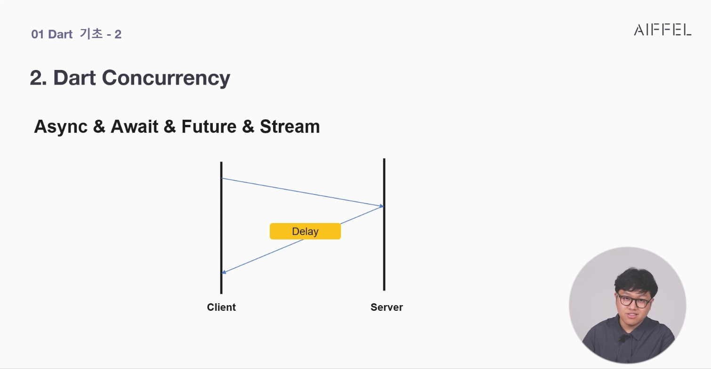

클라이언트와 서버 사이 딜레이가 존재한다.

만약 유튜브를 Synchroneous 방식으로 만들면 유튜브에서 영상을 다운로드 받을때까지 다른 작업을 할 수 없다.

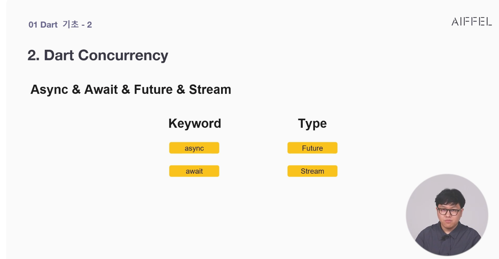


http await 값이 들어가 있어서 Future로 감싸줘야 함.

Stream? : 데이터가 들어오는 것을 계속해서 감시하고 있다가 데이터가 들어오면 그것을 처리하는 것. (데이터 파이프라인이 들어왔다고 표현)

---
### [영상 6] Dart 기초 실습 3-6

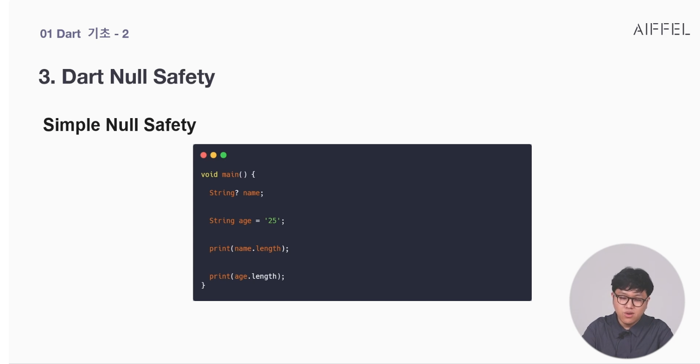

name.length는 길이를 나타내는 내장함수

?는 null check operator로 null인것을 확인했으니 그냥 실행하라는 의미

Dart Null Safety

🔶 Simple Null Safety

```dart
void main() {
  
  String? name;

  
  String age = '25';


  print(name.length);

 
  print(age.length);
}
```
위 코드를 실행하면 length가 null이기 때문에 오류가 발생한다.

아래와 같이 수정하면 오류가 발생하지 않는다.

```dart
void main() {
  
  String? name;
  
  String age = '25';

  print(name?.length);
  
  print(age.length);
}
```
```console
null
2
```
원래 null check operator는 아래와 같이 사용한다.

```dart
void main() {
  
  String? name;

  String age = '25';
  
  if(name != null){
      print(name.length);
  }
  else{
      print('name is null');
  }
  print(name?.length);

  print(age.length);
}
```
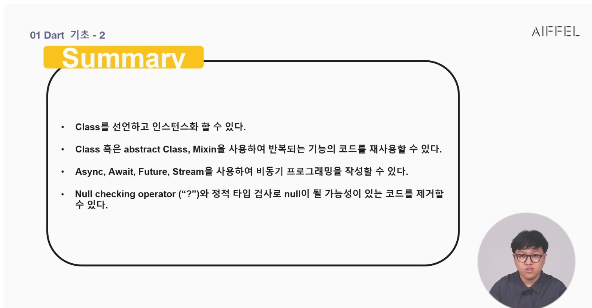

---
### 2-6. Dart To do Project

https://dartpad.dev/embed-html.html?id=df9ae1df6734e235ef590a206cedbcf6&theme=dark
https://dalgonakit.tistory.com/156