### 3-1. Flutter Inside

---

#### [영상 1] Flutter Inside 1

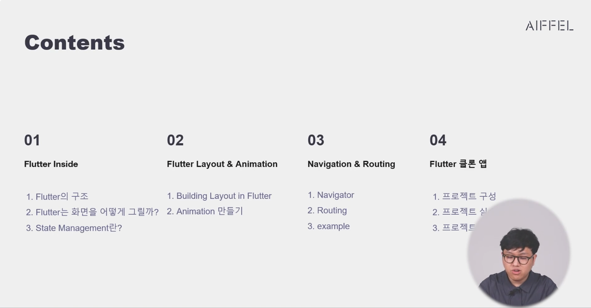
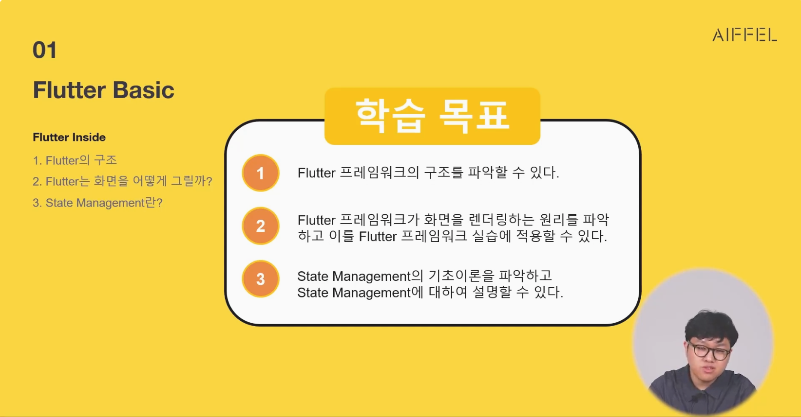

Material / Cupertino : 디자인 시스템. 구글과 애플이 지향하는 디자인을 담아놓음

Widget : UI를 구성하는 요소. 모든 것이 Widget. 

Rendering : Widget을 화면에 그리는 것.

Animation : Widget의 애니메이션을 처리하는 것.

Painting : Widget 색칠하는것

Gestures : Widget의 터치 이벤트를 처리하는 것.

Foundation : Widget의 앱의 기반을 담당하는 것.

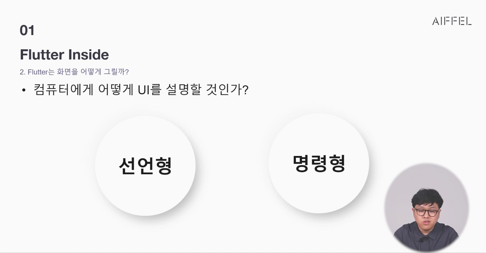
플러터는 선언형 UI

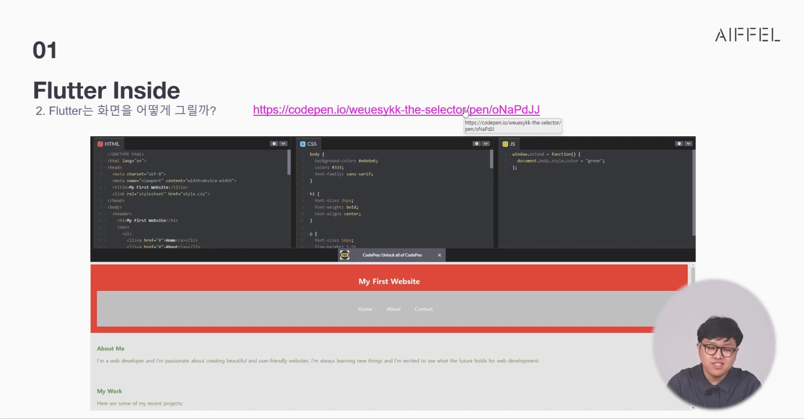
명령형UI : html(구조), css(스타일), javascript(동작)으로 나누어 구현하는 방식


명령형 UI 장점은 분리작업이 가능하다(퍼블리셔와 프론트엔드 엔지니어)

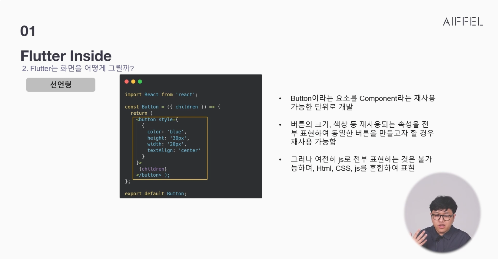

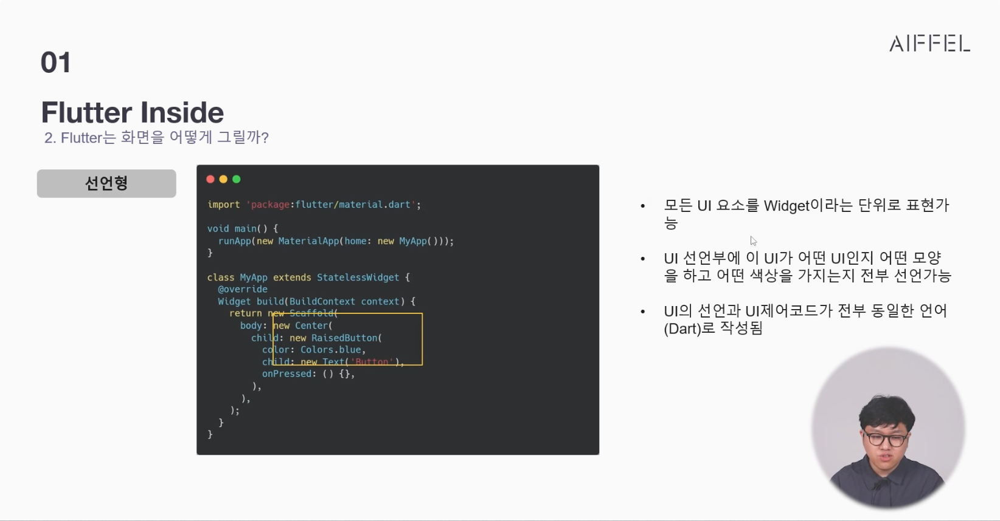


UI를 구성하는 모든 것이 Widget이다. Widget을 잘 다루는 것이 플러터의 핵심


Widget은 트리 형태로 구성이 된다. 트리를 쌓아가는것이 위젯을 구성하는


컨테이너는 투명한 도형이다. 직사각형 박스 단위로 구성이 되며 다른 것을 포장해주는 가장 작은 단위. 

---
### 학습 내용
1. Flutter Inside
 - Flutter의 구조
 - Flutter는 화면을 어떻게 그릴까?
 - State Management란?
2. Flutter Layout & Animation
 - Building Layout in Flutter
 - Animation 만들기
3. Navigation & Routing
 - Navigator
 - Routing
 - Example
4. Flutter 클론 앱
 - 프로젝트 구성
 - 프로젝트 실습
 - 프로젝트 과제

---
### [노트 1] Flutter Inside 1

🔶 Flutter의 구조


🔶 Flutter는 화면을 어떻게 그릴까?

'컴퓨터에게 어떻게 UI를 설명할 것인가?'에 대해서는 크게 두 가지의 방법이 있습니다.

 - 선언형(Flutter는 선언형 UI입니다.)

 - 명령형

선언형(Declarative)과 명령형(Imperative)은 UI를 구축하는 두 가지 접근 방식을 나타냅니다.

선언형(Declarative) 방식은 원하는 결과를 선언하고, 시스템이 그 결과를 얻기 위해 어떻게 동작해야 하는지를 추론하도록 하는 방식입니다. 즉, 목표 상태를 명시하고 시스템이 해당 상태를 달성하도록 지시합니다. 선언형 프로그래밍은 "무엇(What)"에 초점을 맞추며, 개발자는 UI의 상태나 구성을 설명하고 필요한 조건을 정의합니다. 선언형 방식은 코드의 가독성과 유지 보수성을 높일 수 있으며, 개발자가 작업의 상세한 제어를 처리하지 않아도 되는 장점이 있습니다.

반면에 명령형(Imperative) 방식은 시스템에게 원하는 작업의 단계를 명시적으로 지시하는 방식입니다. 개발자는 원하는 결과를 달성하기 위해 작업의 순서와 세부 사항을 명령적으로 작성합니다. 명령형 프로그래밍은 "어떻게(How)"에 초점을 맞추며, 개발자는 UI를 구축하는 각 단계를 프로그래밍적으로 작성해야 합니다. 예를 들어, 웹 프론트엔드에서 JavaScript의 DOM 조작을 사용하여 UI를 업데이트하는 것은 명령형 방식의 예입니다. 명령형 방식은 더 많은 제어와 유연성을 제공하지만, 코드의 복잡성과 가독성이 증가할 수 있으며, 잠재적으로 버그가 발생할 가능성이 높아질 수 있습니다.

코드펜 사이트 링크(https://codepen.io/weuesykk-the-selector/pen/oNaPdJJ)

화면을 그리는데 필요한 최소한의 단위로 Widget이 있습니다. Widget은 UI에서 재사용 가능한 구성 요소입니다. Widget은 버튼, 텍스트 상자, 드롭다운 목록, 체크박스, 슬라이더 등과 같은 다양한 UI 요소를 나타낼 수 있습니다. 이러한 UI 요소들은 사용자와 상호작용하거나 정보를 표시하기 위해 사용됩니다.

기본적인 Widget의 요소로는 다음의 것들이 있습니다.

Text : 텍스트 Widget은 화면에 텍스트가 존재한다고 Flutter에 알려줍니다.

Row, Column : 수평(Row) 및 수직(Column) 방향으로 레이아웃이 존재한다고 Flutter에 알려줍니다.

Stack : Widget이 서로 쌓이는 구조로 생성될 수 있다고 Flutter에 알려줍니다.

Container : Container Widget은 직사각형과 같은 도형을 표현하는 데 사용됩니다. Container는 배경, 테두리, 또는 그림자와 같은 BoxDecoration으로 장식할 수 있고 또한 크기에 Margin, Padding, 및 Constraints를 적용하여 Flutter에게 화면을 그리라고 알려줄 수 있습니다.

---
### [영상 2] Flutter Inside 2


가장 위 부모 트리가 있고 밑에 자식 트리가 있다. 

#### state
우리가 알고 있는 상태라는 의미외 다른 개념을 추가해 이해해야 한다.


유저의 액션에 의해 변화하는 정보를 어딘가에 저장해야 한다. 서버나 데이터 베이스의 경우 응답속도가 느리기 때문에 state를 사용한다.

일부 변경 수정되는 정보는 그 변경과 수정을 추적하고 UI에 반영해야 한다. 어플리케이션에 메모리가 있고 그 메모리에 저장된 정보가 추적되고 UI에 반영되어야 한다.
state를 관리하는것은 UI에 표시되는 것을 관리하는 것도 있지만 state에 많은 정보가 담겨있을 경우 어플리케이션의 메모리 사용량도 늘어난다.
state에 담겨 있는 정보를 UI에 표현되는 데이터 관리하고 정리하고 추적하고 메모리관리까지 생각해야 하는 것이 state management이다.


state management는 UI가 다시 새로운 화면으로 그려지기 위해서 사용자에게 이벤트나 액션으로 받은 정보들, 클릭, QR등의 정보가 입력된 정보들이 UI에 어떻게 표현되어야 하는지에 대한 데이터를 기록해둔 그리고 그데이터를 메모리에 쌓아둔것이 state


single widget : 하나의 위젯이 하나의 state를 가지고 있을 경우 ephemeral state 사용
multi widget : 여러개의 위젯이 하나의 state를 가지고 있을 경우 app state 사용
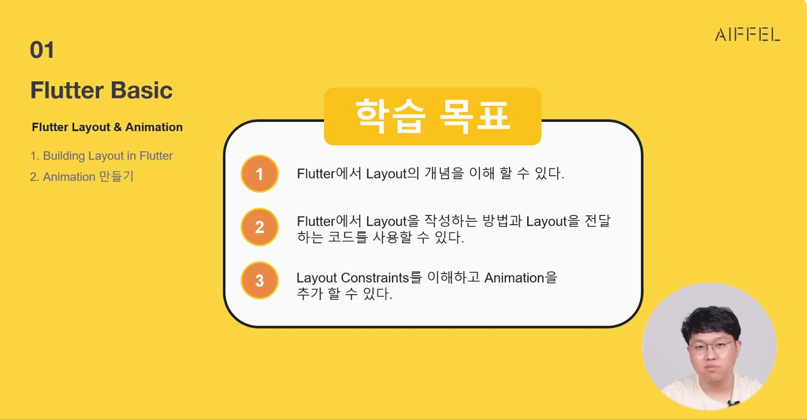

---
### [노트 2] Flutter Inside 2

🔶 State Management란?

State는 앱의 데이터 모델이나 UI의 변화를 추적하고 관리하는 개념을 의미합니다. Flutter는 UI와 상태를 분리하여 개발하는 리액티브(Reactive) 프레임워크입니다. 상태는 앱이 실행되는 동안 변경될 수 있는 데이터의 현재 값이며, 이러한 변경은 UI에 반영되어 화면이 업데이트됩니다.

"State란 어떤 시점에서 UI를 다시 빌드하기 위해 필요한 모든 데이터"

State에는 다음 두 종류가 있습니다.


---
### 3-2. Flutter Layout & Animation

#### [영상 1] Flutter Layout & Animation 1


Layout : UI를 구성하는 요소들을 배치하는 것


투명한 직사각형 상자를 어떻게 구성하는, 어떻게 공간을 채워나가는가를 고민하는 것이 Layout
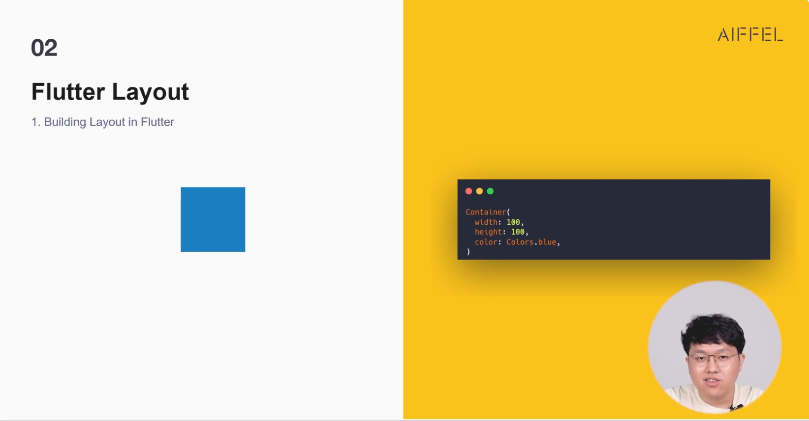
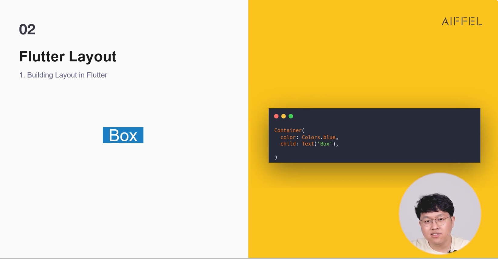
컨테이너에 너비나 높이를 주지 않고 자식위젯을 먼저 작성한 경우 자식위젯이 부모 위젯의 사이즈를 결정한다.
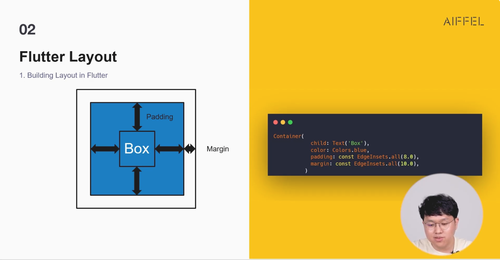
Padding / Margin : 컨테이너 안에 보이지 않는 공간을 설정하는 것
Padding : 요소 안쪽에 자식위젯을 가졌을때 자식과 부모 사이 거리
Margin : 컨테이너 사이의 거리
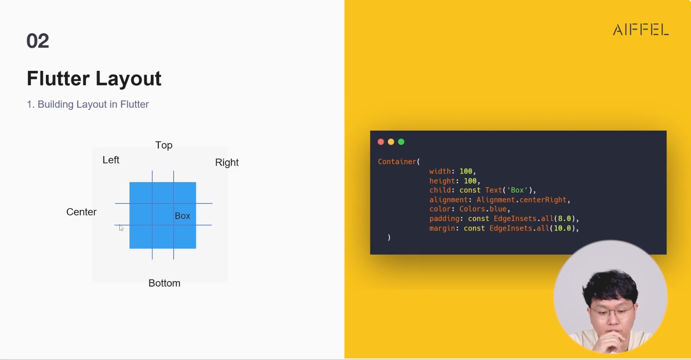
Alignment : 2D의 경우 9개의 구역을 가지고 정렬을 시킬 수 있다. ex) center, top, bottom, left, right, top left, top right, bottom left, bottom right

부모 위젯의 사이즈를 결정하지 않으면 자식위젯이 꽉 채워버린다.

Constraint(제약) : 제약이 없으면 자식위젯이 부모위젯과 동일한 크기까지 커진다. 부모 위젯은 자식 위젯에게 제약 사항을 내린다. 자식 위젯은 부모 위젯의 제약 사항을 받아서 그 안에서 자신의 크기를 결정한다.

노란색 바탕이 부모 위젯. 부모 위젯이 자식 위젯의 사이즈를 제약사항으로 내려준다.
점선으로 표시된 부분이 Padding. 
부모가 정해준 제약사항을 넘어서는 자식 위젯이 나오면 over flow 발생함.
기본적으로 플러터의 제약사항은 없다. 자식 위젯의 사이즈를 정하지 않으면 부모위젯의 사이즈까지 커진다.
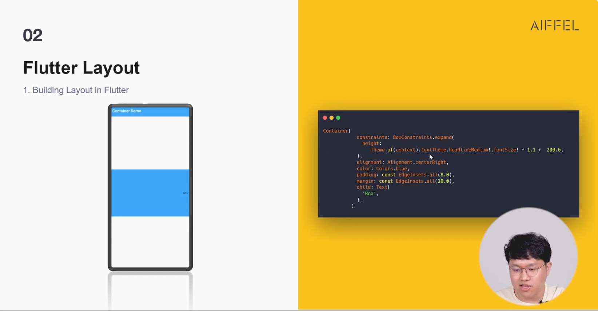

---
### [노트 1] Flutter Layout & Animation 1
Flutter Layout

🔶 Building Layout in Flutter

Layout은 위젯의 배치와 크기 조정을 다루는 개념입니다. Layout은 UI 요소들을 화면에 배치하고 구성하는 방법을 결정합니다. Flutter는 위젯을 조합하여 다양한 Layout을 구성할 수 있는 강력한 도구를 제공합니다.

Layout에는 Vertical, Horizontal, Align, Sizing, Material, Cupertino 등의 구성요소가 존재합니다. Vertical과 Horizontal은 각각 수직과 수평의 방향으로 레이아웃 요소를 배열하는 것을 의미합니다. Align은 자식 위젯의 정렬을 설정하는 데 사용하며, Sizing은 위젯의 크기를 조정하는데 사용하는 요소입니다. 특히 Material과 Cupertino은 두 가지 다른 디자인 시스템을 나타내는데, Material은 구글의 디자인 언어인 Material Design에 기반을 둔 디자인 시스템이며, Cupertino는 Apple의 iOS 디자인을 따르는 디자인 시스템입니다. Flutter는 이러한 두 가지 디자인 시스템을 모두 지원하여 플랫폼 간에 일관된 사용자 인터페이스(UI)를 구축할 수 있습니다.

Flutter에서는 위젯 트리 구조를 사용하여 Layout을 구성합니다. 위젯 트리는 위젯들의 계층 구조로 이루어져 있으며, 화면에 표시될 위젯들이 계층적으로 배치됩니다. 각 위젯은 부모 위젯의 제약 조건에 따라 위치와 크기를 결정합니다.

---
### [영상/실습 2] Flutter Layout & Animation 2

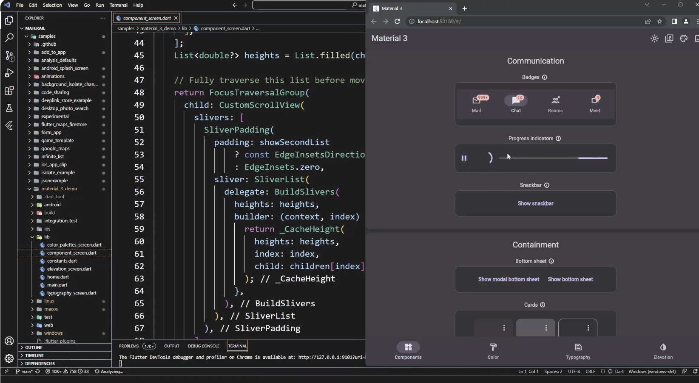
https://github.com/flutter/samples/tree/main/material_3_demo
https://flutter.github.io/samples/web/material_3_demo/
소스코드를 불러와서 실행해보자

---
### [영상 3] Flutter Layout & Animation 3


운영체제에 맞게 가장최적화된 디자인을 미리 구성

https://flutter.github.io/samples/web/material_3_demo/

Material3 vs Cupertino
디자인을 불러올때 시스템 UI를 불러오게 되면 디자인을 준수하지 않으면 구현이 되지 않을수 있다.


스캐폴드는 앱의 기본적인 뼈대를 만들어주는 위젯이다. 앱바, 바디, Bottom Navi, Drawer를 가지고 있다.
스캐폴드가 Parent 위젯이고 그 안에 자식 위젯들에게 물려준다.
appbar : 앱바는 앱의 상단에 위치하며, 앱의 타이틀이나 메뉴 버튼 등을 포함할 수 있습니다.
body : 앱의 메인 콘텐츠를 포함하는 영역입니다.
bottomNavigationBar : 앱의 하단에 위치하며, 탭을 통해 다른 화면으로 이동할 수 있는 탭바를 포함할 수 있습니다.
drawer : 앱의 좌측에 위치하며, 메뉴를 포함할 수 있습니다.


---
### [영상 4] Flutter Layout & Animation 4

```dart
import 'package:flutter/material.dart';

const Color darkBlue = Color.fromARGB(255, 18, 32, 47); //컬러는 색을 지정할건데 255는 투명도, 18, 32, 47은 RGB값으로 하자는 의미

void main() { //메인함수 선언
  runApp(MyApp()); // runApp은 위젯을 실행하는 함수
}

class MyApp extends StatelessWidget { // StatelessWidget은 상태가 없는 위젯
  @override // 뒤집어 쓰겠다는 의미
  Widget build(BuildContext context) { 
    return MaterialApp( // 머티리얼의 요소를 사용할 준비가 되어있어 라는 의미
        theme: ThemeData.dark().copyWith( 
          scaffoldBackgroundColor: darkBlue, // scaffoldBackgroundColor : 스캐폴드의 배경색을 지정
        ),
        debugShowCheckedModeBanner: false, // 앱 실행시키면 디버그 뱃지가 생기는데 디버그 배너를 지워준다.
        home: Scaffold(
          appBar: AppBar( // scaffold의 appbar를 지정
            title: Text('App Bar'), // appbar의 타이틀을 지정
            leading : Text('leading'), // leading은 appbar의 왼쪽에 위치하는 요소
          ),
          body: Center(
            child: Text('This is the body of the app.'), // body의 중앙에 위치하는 요소
          ),
          bottomNavigationBar: BottomNavigationBar( // scaffold의 bottomNavigationBar를 지정, bottomNavigationBar는 BottomNavigationBar 위젯만 사용가능
            items: <BottomNavigationBarItem>[ //[]는 리스트를 의미. 리스트 타입이 BottomNavigationBarItem
              BottomNavigationBarItem( // BottomNavigationBarItem은 BottomNavigationBar의 자식 위젯
                icon: Icon(Icons.home), // 내장 icon을 사용할 수 있다.
                label: 'Home',
              ),
              BottomNavigationBarItem(
                icon: Icon(Icons.settings),
                label: 'Settings',
              ),
            ],
          ),
          floatingActionButton: FloatingActionButton( // scaffold의 floatingActionButton를 지정. 떠있는 액션버튼
            child: Icon(Icons.add),
            onPressed: () { // 버튼을 눌렀을때 발생하는 기능을 적는 함수
              // Do something
            },
          ),
        ),);
  }
}
```

---
### [실습 4] Flutter Layout & Animation 4

실습코드

https://dartpad.dev/?id=80de4a4624c891e4c8db7ae2eae7d004

---
### [영상 5] Flutter Layout & Animation 5


Single Child, Multi Child, Silver는 위젯의 자식(Children) 구성을 다루는 방식을 나타내는 용어입니다.

Single Child: 하나의 자식 위젯만을 가지는 위젯입니다. (일자로 하나의 트리로 구성) 주로 하나의 위젯을 정렬하거나 크기를 조정하는 데 사용됩니다. 예를 들어, Container 위젯은 하나의 자식 위젯을 가지고 자식 위젯을 정렬하고 크기를 조정할 수 있습니다.

Multi Child: 여러 개의 자식 위젯을 가질 수 있는 위젯입니다. 주로 여러 위젯을 배열하고 정렬하여 구성합니다. 예를 들어, Row 위젯은 가로로 여러 개의 자식 위젯을 배열하며, 각 자식 위젯은 가로 축을 따라 배치됩니다.

Silver: 스크롤 가능한 위젯을 구성하는 데 사용되는 개념입니다. 스크롤 가능한 영역을 제공하고, 다양한 자식 위젯을 배치할 수 있습니다. ListView, GridView, CustomScrollView 등이 Silver 위젯에 속합니다.

이러한 위젯 구성 방식을 사용하여 Flutter에서 다양한 UI 요소와 레이아웃을 구현할 수 있습니다.


single child는 속성하나를 확실하게 상속시키기 위해 사용한다.

배치나 정렬 특정속성을 유지하고 싶을때 single child를 사용한다.


밑에 몇개가 될지 모르는 child를 가지고 있어서 들어오는 순서대로 쌓아줄때 column을 사용한다.

---
### [영상 6] Flutter Layout & Animation 6

https://dartpad.dev/?id=39d8215f3df9c8d1298ed907d7b36b24

```dart
import 'package:flutter/material.dart';


void main() {
  runApp(MyApp());
}

class MyApp extends StatelessWidget {
  @override
  Widget build(BuildContext context) {
    return MaterialApp(
      debugShowCheckedModeBanner: false,
      home: Scaffold(
        appBar: AppBar(title: const Text('Flutter Demo')),
        body: const Center(
          child: Row(
            mainAxisAlignment: MainAxisAlignment.center, // 세로 축 가운데 정렬
            crossAxisAlignment: CrossAxisAlignment.center, // 가로 축 가운데 정렬
            textDirection: TextDirection.rtl,
            children: <Widget>[
              Text('This is a Text'),
              Text('This is another Text'),
              Text('This is third Text'),
            ],
          ),
        ),
      ),
    );
  }
}

```

---
### [영상 7] Flutter Layout & Animation 7


triger : 트리거는 애니메이션을 시작하는 것. 사용자가 특정한 액션을 취하면 애니메이션이 시작된다.

tween : 트윈은 애니메이션의 시작과 끝을 정의하는 것(애니메이션 변화 범위). 애니메이션의 시작과 끝을 정의하고 그 사이의 값을 애니메이션으로 만들어준다.

controller : 컨트롤러는 애니메이션을 제어하는 것. 애니메이션을 시작하고 멈추고 반복하고 정지하는 것을 컨트롤러가 담당한다.

---
🔶 Animation 만들기

Animation은 쉽게 움직이는 그림이라고 생각할 수 있으며, 구제적으로는 시간에 따라 변화하는 값의 시퀀스입니다. 예를 들어, Animation을 통해 위젯의 위치, 크기, 투명도 등을 부드럽게 변화시킬 수 있습니다.

Trigger, Tween, Controller는 Animation을 다루는 데 사용되는 개념들입니다.

Trigger : Trigger는 Animation을 시작하거나 정지시키는 이벤트입니다. 예를 들어, 버튼을 클릭하거나 화면 스크롤 등의 사용자 입력이나 시간 지연과 같은 이벤트를 트리거로 사용할 수 있습니다. Trigger는 Animation의 시작 또는 정지를 제어하고, Animation을 원하는 시점에서 시작하거나 중지할 수 있도록 도와줍니다.

Tween : Tween은 Animation에서 시작 값과 종료 값을 보간하는 방법을 정의하는 객체입니다. Tween은 Animation의 전반적인 동작을 결정합니다. Flutter에서는 Tween 클래스를 사용하여 Tween을 정의합니다. 예를 들어, 시작 값과 종료 값을 정의하고, Tween 객체를 생성한 후, 이를 Animation 객체와 결합하여 Animation을 만들 수 있습니다. Tween은 Animation의 현재 시간에 따라 시작 값과 종료 값을 보간하여 Animation의 중간 값을 생성합니다.

Controller : Controller는 Animation을 제어하고 상태를 관리하는 객체입니다. Controller를 사용하여 Animation을 시작, 정지, 재생, 역재생 등의 동작을 수행할 수 있습니다. Flutter에서는 AnimationController 클래스를 사용하여 Controller를 생성하고 Animation을 제어합니다. Controller는 Animation의 진행 상태와 속도, 지속 시간 등을 관리합니다.

이러한 개념들을 조합하여 Flutter에서 Animation의 동작을 정밀하게 제어하고 다양한 효과를 구현할 수 있습니다.

---
### [영상 8] Flutter Layout & Animation 8

https://dartpad.dev/?id=014b5713a07743fe6f82d547da1ee3d9

```dart
import 'dart:math';

import 'package:flutter/material.dart';

void main() => runApp(const AnimatedContainerApp());

class AnimatedContainerApp extends StatefulWidget {
  const AnimatedContainerApp({super.key});

  @override
  State<AnimatedContainerApp> createState() => _AnimatedContainerAppState();
}

class _AnimatedContainerAppState extends State<AnimatedContainerApp> {
  // Define the various properties with default values. Update these properties
  // when the user taps a FloatingActionButton.
  double _width = 50;
  double _height = 50;
  Color _color = Colors.green;
  BorderRadiusGeometry _borderRadius = BorderRadius.circular(8);

  @override
  Widget build(BuildContext context) {
    return MaterialApp(
      home: Scaffold(
        appBar: AppBar(
          title: const Text('AnimatedContainer Demo'),
        ),
        body: Center(
          child: AnimatedContainer(
            // Use the properties stored in the State class.
            width: _width,
            height: _height,
            decoration: BoxDecoration(
              color: _color,
              borderRadius: _borderRadius,
            ),
            // Define how long the animation should take.
            duration: const Duration(seconds: 1),
            // Provide an optional curve to make the animation feel smoother.
            curve: Curves.fastOutSlowIn,
          ),
        ),
        floatingActionButton: FloatingActionButton(
          // When the user taps the button
          onPressed: () {
            // Use setState to rebuild the widget with new values.
            setState(() {
              // Create a random number generator.
              final random = Random();

              // Generate a random width and height.
              _width = random.nextInt(300).toDouble();
              _height = random.nextInt(300).toDouble();

              // Generate a random color.
              _color = Color.fromRGBO(
                random.nextInt(256),
                random.nextInt(256),
                random.nextInt(256),
                1,
              );

              // Generate a random border radius.
              _borderRadius =
                  BorderRadius.circular(random.nextInt(100).toDouble());
            });
          },
          child: const Icon(Icons.play_arrow),
        ),
      ),
    );
  }
}
```

---
### 3-3. Navigation & Routing

#### [영상 1] Navigation & Routing 1


컵안에 화면이 하나씩 쌓여 있는 구조

pop()을 사용하면 스택에서 제거된다.
페이지를 다음과 같이 저장한다고 생각하면 된다. 뒤로가기 버튼을 눌러 화면 B가 나와야 하면 push()를 사용하고 화면 B에서 다시 화면 A로 돌아가야 하면 pop()을 사용한다.

네비게이터와 라우터 : 네비게이터는 그 화면까지 갈 수 있는 자동차이고 라우터는 그 화면의 주소라고 생각하면 편하다.
네비게이터와 라우터 사이 네비게이션처럼 안내를 해주는 경로를 설명하는 방식이 두가지가 있다

NamedRouter : 라우터를 이름으로 지정해주는 방식 (화면숫자가 많지 않을때 화면의 이름을 전부 지어주는 방식)

---
### [노트 1] Navigation & Routing 1

Navigation & Routing

🔶 Navitagor

Navigator는 화면 정보가 쌓이는 정보 Widget입니다. Navigator를 사용하여 다른 화면으로 이동하거나 이전 화면으로 돌아갈 수 있습니다.


https://dartpad.dev/?id=3ddaab6b542a2bb0052cb097c1caad40

---
### [영상 2] Navigation & Routing 2

Navigation 코드 예시
```dart
import 'package:flutter/material.dart';

void main() {
  runApp(MyApp());
}

class MyApp extends StatelessWidget {
  @override
  Widget build(BuildContext context) {
    return MaterialApp(
      title: 'Flutter Demo',
      home: MyHomePage(),
    );
  }
}

class MyHomePage extends StatefulWidget {
  @override
  _MyHomePageState createState() => _MyHomePageState();
}

class _MyHomePageState extends State<MyHomePage> {
  final List<Song> songs = [
    Song(name: 'Bohemian Rhapsody'),
    Song(name: 'Imagine'),
    Song(name: 'What a Wonderful World'),
  ];

  @override
  Widget build(BuildContext context) {
    return Scaffold(
      appBar: AppBar(
        title: Text('Flutter Demo'),
      ),
      body: ListView.builder(
        itemCount: songs.length,
        itemBuilder: (context, index) {
          final song = songs[index];
          return ListTile(
            title: Text(song.name),
            onTap: () { // onTap은 클릭했을때 발생하는 이벤트
              Navigator.of(context).push(
                MaterialPageRoute(
                  builder: (context) => SongScreen(song: song), // SongScreen으로 이동, 네비게이터
                ),
              );
            },
          );
        },
      ),
    );
  }
}

class Song {
  String name;

  Song({required this.name});
}

class SongScreen extends StatelessWidget {
  final Song song;

  const SongScreen({super.key, required this.song});

  @override
  Widget build(BuildContext context) {
    return Scaffold(
      appBar: AppBar(
        title: Text(song.name),
      ),
      body: Center(
        child: Text(song.name),
      ),
    );
  }
}

```

---
### [영상 3] Navigation & Routing 3

Route 설명

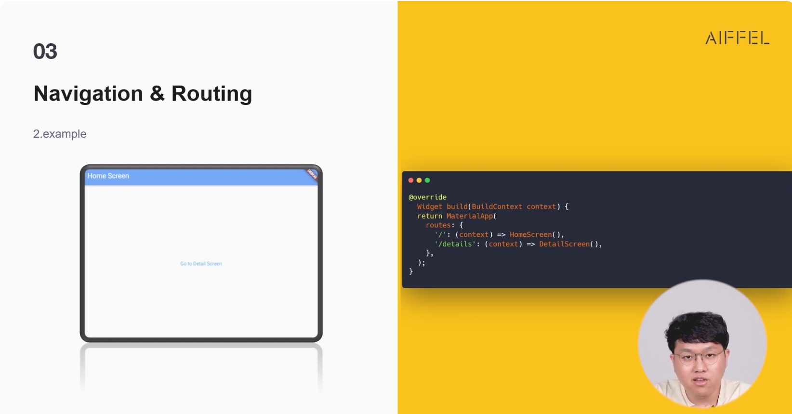
'/'를 이용해 홈페이지 주소처럼 루트 주소를 지정해주는 방식

```dart
import 'package:flutter/material.dart';

void main() {
  runApp(MyApp());
}

class MyApp extends StatelessWidget {
  @override
  Widget build(BuildContext context) {
    return MaterialApp(
      //Route를 지정해주는 방식
      route:{
        '/': (context) => HomeScreen(),
        '/details': (context) => DetailScreen(),
      },
      title: 'Flutter Named Route Example',
      // Navigator 방식
      // title: 'Flutter Named Route Example',
      // home: HomeScreen(), // 이부분을 변경하여 home Screen과 Detail Screen을 변경할 수 있다.
    );
  }
}

class HomeScreen extends StatelessWidget {
  @override
  Widget build(BuildContext context) {
    return Scaffold(
      appBar: AppBar(
        title: Text('Home Screen'),
      ),
      body: Center(
        child: TextButton(
          onPressed: () {
            // Navigate to the DetailScreen using the `/details` route.
            Navigator.pushNamed(context, '/details');
          },
          child: Text('Go to Detail Screen'),
        ),
      ),
    );
  }
}

class DetailScreen extends StatelessWidget {
  @override
  Widget build(BuildContext context) {
    return Scaffold(
      appBar: AppBar(
        title: Text('Detail Screen'),
      ),
      body: Center(
        child: Text('This is the Detail Screen.'),
      ),
    );
  }
}
```