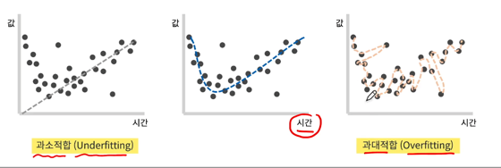
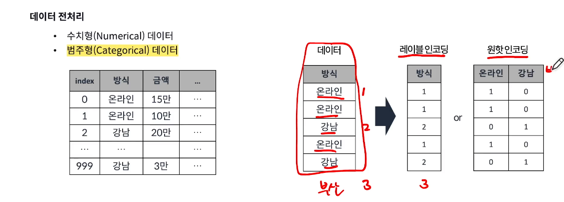
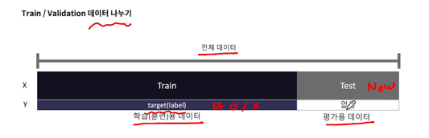
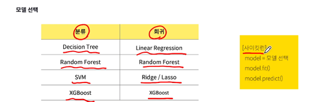
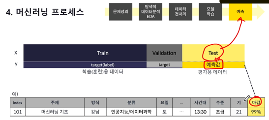
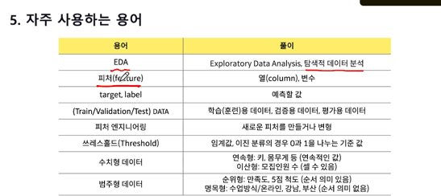

1. 머신러닝이란? / 종류

-지도학습은 레이블이 있다. 분류, 회귀

분류는 이진분류, 다중분류가 있다.

회귀는 연속된 숫자값을 예측한다. 집값, 수요 등등

-비지도 학습은 레이블이 없지만 데이터를 통해 규칙을 찾는다. 군집을 통해 규칙을 확인. 군집화, 차원축소

차원축소는 정말 많은 컬럼들을 축약해서 나타내는 형태

-강화학습은 알파고, 환경을 통해 보상을 받아서 학습을 한다.

2. 머신러닝이란2

기존 룰베이스에 따라 규칙과 결과를 만들었다면

데이터 및 해답을 머신러닝에 넣으면 규칙이 만들어지고 새로운 데이터가 오면 기존에 전문가의 규칙을 썼다면 머신러닝에서는 데이터를 통해 규칙을 만들어서 새로운 데이터를 예측한다.

3. 과소적합 / 과대적합

  

과소적합(Underfitting)은 모델이 학습 데이터와 테스트 데이터에서 모두 낮은 성능을 보이며, 데이터의 패턴을 충분히 학습하지 못한 상태를 의미합니다. 과대적합(Overfitting)은 모델이 학습 데이터에 지나치게 적응해 테스트 데이터에서 낮은 성능을 보이는 상태로, 일반화 능력이 떨어지는 현상을 의미합니다.  

4. 머신러닝 프로세스  

문제정의 -> 탐색적 데이터 분석 EDA -> 데이터 전처리 -> 모델 학습 -> 예측  

문제정의 : 무엇을 예측해야 하는가, 회귀인지 분류인지 판단, 평가방식은 어떤것으로 할것인지 정해야 함.  
분류문제는 정확도, 회귀문제는 RMSE, MAE, R2등을 사용한다.  
*정확도 : 전체 데이터 중 맞게 예측한 데이터의 비율(7/10 = 70%)  

탐색적 데이터 분석 EDA : 데이터의 크기, 결측치(삭제하거나 채우기), 분류할때는 레이블의 비율(target), 컬럼(피처)타입, 수치형 데이터인지 범주형 데이터
그래프나 그림등으로 확인한다.  

데이터 전처리 : 
결측치 처리- (최빈값, 최고값, 평균값, 중앙값, 최소값, 삭제)
이상치 처리 - 삭제 변경, IQR(사분위수)방식(75% 에서 25% 빼는 방식) 3Q + 1.5IQR, 1Q - 1.5IQR 의 값을 이상치로 볼 수도 있다

수치형 데이터
모든데이터를 수치화 해야 한다.
모델이 학습하기 좋은 데이터로 변경해 주어야 한다. (3만원 -> 30000)
민맥스 스케일(모든 값을 0과 1사이로 변경, x- min / max - min)

범주형 데이터    
원핫인코딩(컬럼의 값을 컬럼으로 변경)
레이블인코딩

  

모델학습 : 학습용 데이터와 평가용 데이터로 나눈다.
평가용 데이터는 레이블이 없다  

train data(검증용 데이터)를 다시 train data(학습용 데이터)와 validation data(검증용 데이터)로 나눈다.  
  
모델이 잘 만들어졌는지 검증하기 위해 레이블이 있는 데이터를 검증용 데이터로 사용한다. (7:3 or 8:2)  

모델선택  
  

  
test data(평가용 데이터)를 가지고 예측을 하게 된다.  

5. 머신러닝에서 자주 사용하는 용어  
  
쓰레스 홀드는 임의 변경 가능  

