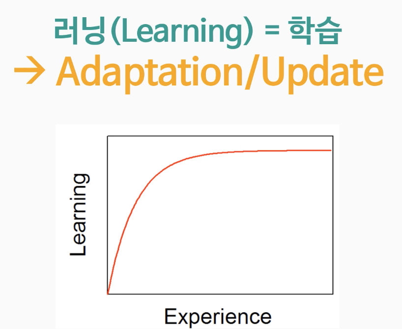
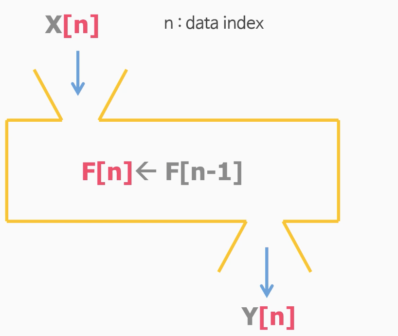

# 1. 인공지능은 사람을 대체할 수 있을까?  

## 1-2 인공지능의 개요와 현황  

유럽연합(EU)의회의 'AI로봇 결의안'  

- 킬스위치 : 로봇 작동을 멈추는 버튼 장착  
- 주요원칙 : 로봇은 인간을 위협하면 안됨  

인공지능으로 인해 사라질 직업들  

- '사'자가 들어간 전문가들이 많음(ex. 의사, 변호사, 회계사 등등)
- 특정한 도메인에 대해서 많은 지식을 알고 있는 전문가들  
- 기존의 지식을 많이 외우고 있고 특정 패턴에 대해 명확히 얘기할 수 있는 사람들  
- 인공지능은 특정 패턴에 대해서 명확히 얘기할수 있기 때문  
- 인공지능으로 인해 사라지지 않을 직업은 '건물주'라고 생각..(털썩..)  

## 1-3 인공지능이란 무엇인가?  

인공지능을 단순화해서 생각해보자  

- 입력이 주어지면 출력을 내보낸다 (ex. 이미지 분류 - 강아지 사진을 보여주면 강아지 텍스트 출력)  
- 인공지능은 함수와 유사하다. 더 쉽게는 수수께끼 상자  
- 입력 3, 출력은 6 이면 수수께끼 상자안은 *2  

## 1-4 인공지능은 왜 무서워졌을까  

- 함수의 입장에서 인공지능을 바라보면 인공지능이 왜 무서워졌는지 알수 있다.(사람이 쉽게 할 수 없는 계산을 아주 쉽게 풀이)  
- 수학적으로 표현할 수 없었던 복잡한 인간의 두뇌를 데이터를 기반으로 흉내내다.  
- 인간의 두뇌는 너무 복잡해서 간단한 수학으로는 표현이 어려움.  
- 하지만 인공지능은 구슬을 던져서 도형의 넓이를 구하는 함수를 만들었듯 
- 데이터를 던져서 사람의 두뇌를 모델링해내는 기법을 만들어 낸것이 인공지능  

## 1-5 인공지능, 머신러닝은 다른가?  

머신 러닝의 개념  
- 인공지능을 보다 똑똑하게 만들기 위해서는 머신 러닝이라는 방식을 사용함  
- 머신 러닝은 인공지능과 같은 것인지 다른 것인지 살펴보려고 함  

그네의 움직임  

- 그네가 움직이는 동안에 숫자 1로 표현되면 서 있는 거고 숫자 0으로 표현되면 앉아 있음  
- 그네가 움직이는 주기를 0101로 표현하여 랜덤으로 해서 64명을 준비함  
- 4명의 0과 1을 조합을 해서 교차를 하든지 돌연변이를 넣든지 해서 조합을 가지고 다시 64명을 만듦
- 22세대 정도 되면 제법 그네를 잘 탄다. 이정도부터 유전자의 변화가 거의 없어진다

## 1-6 인공지능 어떻게 똑똑해지는가?  

- 머신러닝 기법을 이용해서 인공지능이 똑똑해진다.  
- 경험을 하면 할수록(데이터가 많이 쌓일수록) 세대가 거듭되면 거듭될수록 배우는 양이 점점 많아지게 됨  

- 어떤 함수에 데이터 인덱스가 붙어서 함수가 조금씩 바뀌어 가는것을 학습한다고 표현함
- 데이터가 많이 들어올수록 점점 인공지능 알고리즘이 학습한다

## 1-7 머신러닝의 세가지 유형(지도, 비지도, 강화학습)

Supervised Learning(지도학습)  

- 정답이 주워진다
- 비교적 문제풀이가 쉽다
- ex) 분류(classification), 회귀(regression), 객체탐지(object detection)

Unsupervised Learning(비지도학습)  

- 정답이 주어지지 않는다
- 미지수가 2개인데 방정식이 1개인 케이스
- 특별한 조건이 있을때 정답이 주어질 수 있다  
- 기본적으로 문제풀이가 어렵다  
- 내 안에 정답이 있다  
- 분류(classification), 회귀(regression), 객체탐지(object detection)

Reinforcement Learning(강화학습)

- (정답이 아닌) Reward가 주어진다  
- ex) 생쥐가 빨간 버튼을 누르면 전기충격을, 초록 버튼을 누르면 치즈(Reward)를 통해 학습함
- ex) 슈퍼마리오 게임 - 버섯돌이가 어디로 가고 있는지 내가 지금 어떻게 뛰고 있는지 이런 정보들을 보고 나서 
- 점프를 할지, 가만히 있을지, 앞으로 갈지 이런 것들을 인공지능 에이전트가 스스로 결정을 함.
- 그렇게 하다 보면 버섯돌이도 잡고 가서 마지막에 깃발을 먹고 깨는 인공지능 알고리즘을 만들어낼 수가 있음.
- 게임, 제어, 로봇 개발
