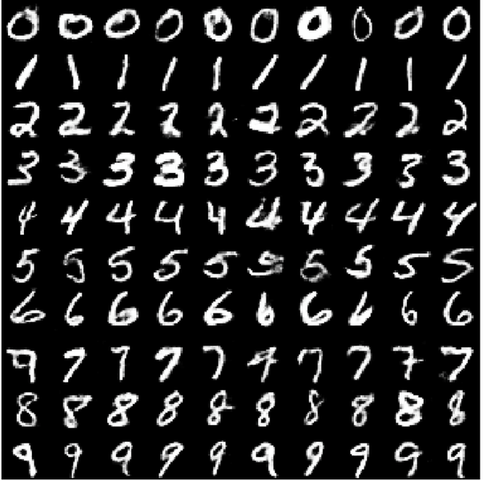
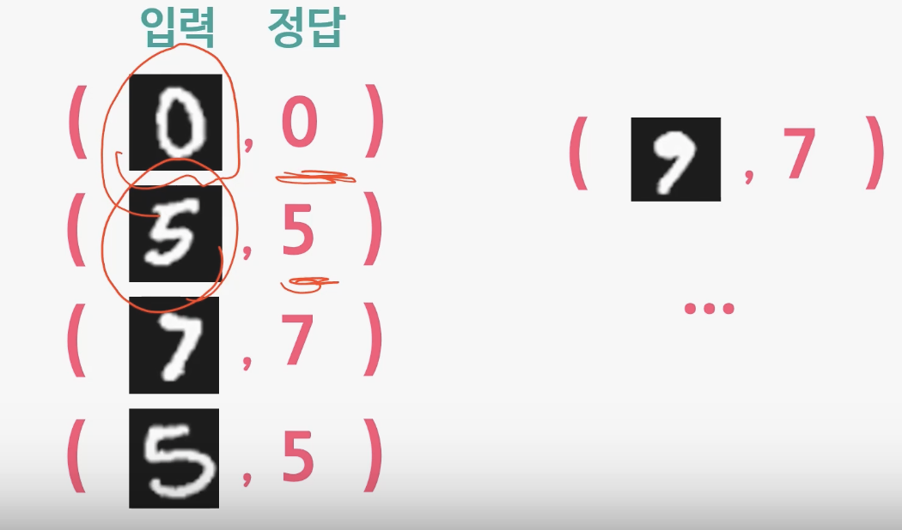

# 2. 기본 중의 기본, Paired Data!  

## 2-1. Paired Data란 무엇인가?

- Paired Data는 무엇일까요?
- Paired Data는 두 개의 변수가 서로 연관되어 있는 데이터를 말합니다.
- 거의 모든 인공지능 개발자들이 가장 먼저 만들어보는 인공지능 기술은 숫자 손글씨 인식기

  

- 페어드 데이터는 입력과 입력 이미지와 정답이 하나의 쌍을 이뤄서 데이터로 주어짐  
- 입력 이미지와 정답은 0 입력 이미지와 정답은 5 이런 식으로 입력과 정답이 하나의 쌍을 이뤄서 데이터로 주어진다라고 해서 
  페어드 데이터라 부름
- 페어드 데이터가 있으면 손쉽게 인공지능 알고리즘을 만들어낼 수 있음