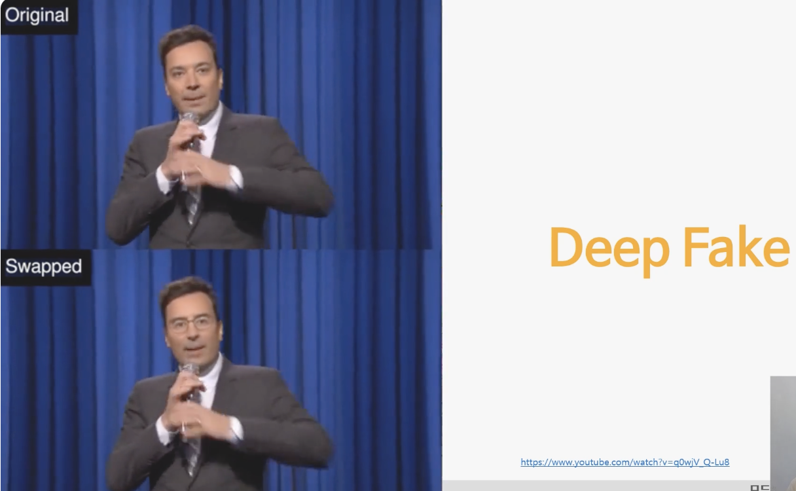
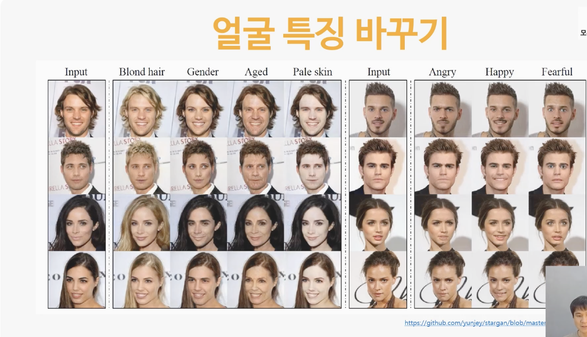
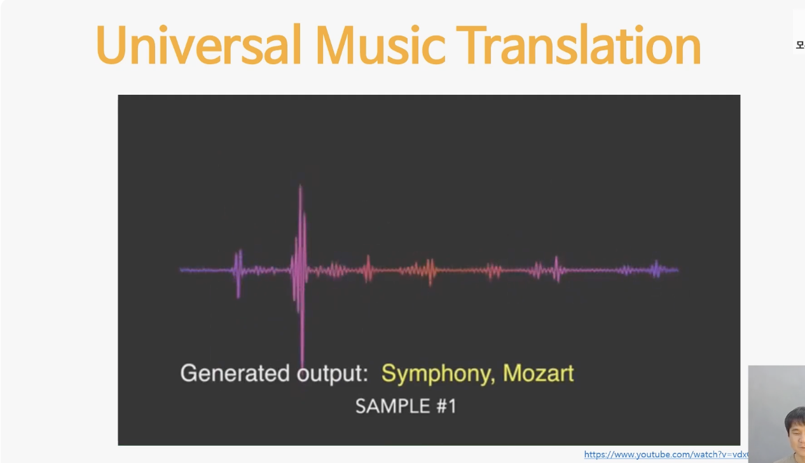

# 3. Paired Data가 없다면? Unpaired Data!  

## 3-1. unpaired data는 무엇인가  

- 기본적으로 페어드 데이터가 없는 상황인데 페어드 데이터인 때 할 수 있는 것처럼 이걸 변환하는 함수 즉 인공지능을 만들어 냄

  
- 똑같이 움직이지는 않지만 우리한테 말 이미지랑 얼룩말 이미지는 굉장히 많음
- 그래서 입력으로 다양한 말의 이미지를 넣고 출력으로 다양한 얼룩말을 가지고 있다면 어떤 함수를 적용하여 만들어볼 수 있지 않을까라는 고민을 계속함
- 정답은 없지만 정답 그룹의 데이터는 가지고 있을 때 언 페어드 데이터라 부름 

Q. paired data와 unpaired data의 차이는 무엇인가요?  

- Paired data와 unpaired data는 데이터의 관계성에 따라 구분됩니다. 
- Paired data는 둘로 분리될 수 있으며, 여기에는 입력과 해당 입력에 대한 출력 또는 레이블(정답)이 짝을 이루는 데이터가 있습니다. 
- Paired data는 데이터가 정렬된 데이터라고도합니다. 반면, Unpaired data는 추출된 데이터가 서로 관련성이 없는 데이터입니다. 
- 대표적인 예로는 자연 이미지나 음악, 텍스트 등이 있습니다. 
- Unpaired data는 선별된 형태로 고유의 특징을 가지며, 순서대로 정렬되어 작업하기 어려운 데이터입니다. 
- Paired data는 일반적으로 지도 학습(supervised learning)에서 사용되며, unpaired data는 비지도 학습(unsupervised learning)에서 사용됩니다. 
- Paired data의 경우 입력과 출력이 짝을 이루기 때문에 결과가 형성되며 이를 바탕으로 학습하여 학습의 정확도를 높일 수 있습니다. 
- 반면, Unpaired data는 데이터 사이의 상관관계를 이용하여 데이터의 패턴을 분석하고, 공통점이나 차이점을 찾아내는 데 사용될 수 있습니다. 
- 따라서, 데이터의 구성은 애플리케이션의 목적과 필요한 결과에 맞게 선택되거나, 적절하게 체계화될 수 있어야 합니다.

## 3-2. unpaired data의 활용_영상과 음성  

  
- 다른 두 명의 영상자료에서 윗 사람과 똑같은 표정으로 똑같은 입 모양으로 똑같은 곳을 바라보면서 연기를 한 그런 어떤 페어드 데이터를 사람도 못 구함
- 이 위에 있는 사람과 아래에 있는 사람이 나온 다양한 영상은 많이 가지고 있음. 그렇기 때문에 이 언페어드 데이터를 이용해서 만들었음
- 이거는 대표적인 언페어드 데이터의 예시  

이번에는 얼굴의 특징을 바꾸는 서비스. 대부분 언페어드 데이터를 이용한 기술들을 활용 

얼굴을 바꾸는 것과 거의 동일한 알고리즘으로 음악의 분위기를 바꾸어줌.
작곡가의 풍에 따라 작곡가의 느낌도 살리면서 악기도 바꾸어줌. 이것도 언페어드 데이터를 이용한 기술

Q. unpaired data를 사용한 예는 무엇이 있나요?  
Unpaired data는 대표적으로 비지도 학습(unsupervised learning)에서 사용됩니다. 이를 이용하여 발생할 수 있는 여러 예시를 아래와 같이 나열해 보았습니다.

1. 이미지 생성(Image Generation) : Unpaired data를 사용하여 새로운 이미지를 생성하는 기술이 대표적입니다. 예를 들어, CycleGAN(순환 적대 신경망, Cycle-Consistent Adversarial Networks)을 이용하여 사진을 가져와서 다시 그것을 예술 작품으로 변환할 수 있습니다.

2. 데이터 변환(Data Transformation) : Unpaired data를 사용하여 데이터와 레이블 간의 연결이 없이 입력을 다른 것으로 바꿉니다. 예를 들어, 블랙 앤 화이트 사진을 컬러사진으로 변경하는 것도 이에 해당합니다.

3. 분산 표현 학습(Latent Space Learning) : Unpaired data로 이루어진 이미지를 latent space 상의 좌표로 매핑하여 이미지 변환, 이미지 합성 및 이미지 조작 등 다양한 응용 분야에 사용할 수 있습니다.

4. 랜덤 노이즈(Random Noise) : Unpaired data로 생성된 랜덤 노이즈는 generative adversial networks(GAN)에서 매우 중요한 개념입니다. GAN은 기본적으로 판별자와 생성자로 구성되며, 생성자는 랜덤 노이즈를 이용하여 이미지를 생성하고, 판별자는 그 이미지가 실제 이미지와 유사한지 판별합니다.

5. 클러스터링(Clustering) : Unpaired data를 이용하여 데이터 간의 유사성을 평가하고, 이를 기반으로 연관성 있는 데이터끼리 묶어서 클러스터링하는 작업을 수행할 수 있습니다.

Unpaired data는 비지도 학습에서 사용되어, 데이터의 특성을 발견하거나 분석하는데 적용됩니다. 이를 이용하여 다양한 분야에서 높은 성능의 결과를 도출하는 연구가 진행되고 있습니다.

## 3-3. 우리가 가진 unpaired data는 무엇이 있을까

