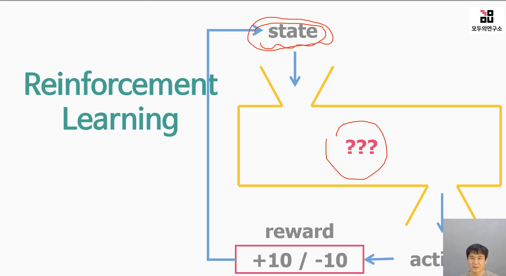

# 4. 정답 데이터도, 정답 그룹 데이터도 없을 때는? 강화학습!

## 4-1. 정답을 모를 때는? 강화학습!

Q. 원하는 목적지로 갈 수 있도록 안전하게 주행하는 자율주행자동차를 만들기 위해 강화학습을 하려고 합니다. 이 강화학습의 state, action, reward를 찾아 보세요.  

자율주행 자동차를 만들기 위한 강화학습의 state, action, reward는 다음과 같습니다.

- State(상태) : 자율주행 자동차의 상태는 시스템에서 감지된 정보를 기반으로합니다. 예를 들어, 주변 차량과의 거리, 차도 중심선과의 거리, 속도, GPS 위치 등이 포함됩니다. 카메라, 레이더, 라이다(LiDAR) 등의 센서를 사용하여 이러한 정보를 수집합니다.

- Action(행동) : 행동 공간(actions)은 자율주행 자동차가 할 수 있는 액션을 나타냅니다. 예를 들어, 가속, 브레이크, 핸들 조작 등이 가능하며, 핸들 조작의 경우 각도를 조정할 수 있습니다. 이러한 행동은 주행 속도 및 방향에 대한 제어에 사용될 수 있습니다.

- Reward(보상) : 자율주행 자동차의 목적은 안전하게 목적지까지 갈 수 있는 것입니다. 이를 위해 강화 학습에서는 보상(reward)을 결정해야합니다. 보상은 학습 알고리즘이 상태(state)와 행동(action)에 대한 적합성을 평가하는 방법입니다. 즉, 보상은 학습 알고리즘이 원하는 목적이 달성되도록 알고리즘을 이용해 조정하게 됩니다. 

일반적으로 자율주행 자동차의 경우, 보상은 안전하게 목적지로 이동하거나 장애물을 회피할 수 있다는 것에 대한 보상으로 설정될 수 있습니다. 예를 들어, 안전하게 주행하여 목적지에 도달하면 임계값으로 지정된 큰 보상값을 부여합니다. 대신 사고가 발생하면 큰 벌점을 줄 수 있습니다. 그리고 차선 유지, 지정된 속도 이하로 주행 등도 추가적인 작은 보상값으로 설정될 수 있습니다.

위와 같이 목적에 맞게 상태, 행동, 보상을 설정하여 강화 학습 알고리즘을 적용하면 더욱 높은 안전성을 가진 자율주행 자동차를 개발할 수 있습니다.  

- 정답을 모르면 즉 페어드 데이터가 없으면 혹은 언페어드 그룹 데이터가 없으면 Unsupervised Learning을 써야 된다고 착각함 
- Unsupervised Learning은 굉장히 특별한 문제 굉장히 특별한 조건이 있는 경우에 쓸 수 있음(거의 안쓰임)
- 정답을 모르는 문제일때 처음 생각해야 되는 방법은 Reinforcement Learning
- 아기 걸음마 예시
  - 아기가 넘어지지 않고 근육이나 관절을 움직여서 걷게 하고 싶을때 체중을 너의 몸무게의 60%를 왼쪽 발에 옮기면서 앞으로 31.5도 기울이고 팔은 오른쪽으로 30도만큼 올리고.... 이런 식으로 해서 알려줄 수가 없음.
  - 정답 데이터를 사람도 모르며 그냥 걸음. 계속 기어다니다가 물건을 만지고 싶을때 잘 걸으면 칭찬이라는 플러스 리워드를 줌 
  - 아기 입장에서도 맨날 기어 다니다가 걸었을 때는 일단 일어설 수 있으니까 두 손이 자유로워지고 먹던 물건을 잡거나 이런 것도 잘할 수 있고 높은 곳에 있는 것도 잡을 수가 있고 더 멀리 갈 수도 있고 리워드를 스스로도 받음
  - 리워드를 받다 보면은 넘어지지 않고 잘 걷게 됨. 
  - 하다 보니까 배우는 것이 강화 학습의 대표적인 예시 
  - 넘어지지면 너무 아프니까 마이너스 리워드 페널티

Q. 강화학습의 예를 써보세요.
Reinforcement Learning은 일반적으로 몇 번의 시도(trial)를 통해 보상 최대화를 위한 최적의 정책(policy)을 학습하는 머신러닝의 한 종류입니다. 강화학습의 예시로는 다음과 같은 것이 있습니다.

1. 로보틱스 : 로봇이 다양한 임무를 수행하도록 하는 자율 로봇 개발에 사용됩니다. 로봇이 어떤 일을 수행할 때, 강화 학습은 보상 함수(reward function)를 이용하여, 지정된 목표를 달성하기 위해 최적의 행동을 학습하도록 돕습니다. 

2. 게임 : 강화 학습은 알파고와 같은 강력한 인공지능 게임 에이전트의 개발에도 이용됩니다. 예를 들어, 강화 학습을 이용하여, 슈퍼 마리오 게임과 같은 2D 온라인 플랫폼 게임 초기 버전에서 이기고, 버전이 업그레이드됨에 따라 더 많은 효과적인 방식으로 이기도록 학습시킬 수 있습니다.

3. 자동차 : 강화 학습은 제어 시스템에 응용하여 자율주행 자동차 등에 사용됩니다. 자율주행 자동차는 센서와 액추에이터의 데이터를 통해 주행 판단 기능을 학습하기 때문입니다. 

4. 자연어 처리 : 강화 학습은 자연어 처리 분야에서도 효과적으로 사용됩니다. 예를 들어, 최적화된 대화 시스템의 개발 및 기계 번역 분야에서 최상의 결과를 가져 올 수 있습니다. 

5. 제조업 : 강화 학습은 제조업분야에서도 적용할 수 있습니다. 제조 산업의 대표적인 학습 예시로는 컴퓨터 제어 인터페이스(CNC) 시스템에서 중요한 역할을 합니다. 강화 학습에 의해 CNC 시스템에서 치수가 일치 할 때 의도한 복잡한 형태를 쉽게 제조할 수 있습니다.

위의 예시들은 강화 학습의 다양한 응용 분야를 보여줍니다. 굳이 이 분야들을 몰라도 강화학습 알고리즘을 이해하고 적용하는 데는 문제가 없습니다.

## 4-2 지도학습 vs 강화학습

- 정답을 알고 있다면, 고민하지말고 Supervised Learning을 쓰면 된다. 정답을 모르는 문제는 Reinforcement Learning을 쓰면 된다.  
- Super Mario를 SL로 학습시킨다는 것은 어떤의미일까? 정답을 알면 일정수준 이상의 성능을 보장할 수 있음. 강화학습은 정답을 모르더라도 할수 있고 사람이 만든 이상을 뛰어넘는 성과를 낼 수 도 있다

Q. 강화학습의 장점은 무엇인가요?
강화학습의 주요 장점은 아래와 같습니다.

1. 새로운 문제에 대한 자율적인 대처 : 강화학습은 에이전트가 스스로 학습하고 경험을 통해 문제를 해결하는 능력을 가집니다. 이는 비선형 문제와 같이 기존의 해결 방법이 없는 문제에 대해 자율적으로 대처할 수 있는 능력을 갖게 됩니다.

2. 강건성(Robustness) : 강화학습은 반복적인 학습을 통해 노이즈와 같은 다양한 환경 변화에 대응하는 능력을 갖게 됩니다. 이는 모델의 강건성을 높이는 데 큰 도움이 됩니다.

3. 자원 효율성 : 강화학습은 미리 정의된 문제에 대해 실행 가능한 최적화를 찾는 모델 기반 최적화 기법과 달리 머신러닝 모델을 자동으로 학습하므로 자원 효율성이 높습니다. 이는 규모가 큰 문제를 다룰 때 중요합니다.

4. 다양한 응용 분야 : 강화학습은 다양한 분야에 적용 가능합니다. 게임, 로봇 제어, 자율 주행, 자연어 이해, 추천 시스템 등에 적용할 수 있습니다. 

여러가지 장점 중에서도 강화학습이 문제를 푸는 방식이 기존의 인공지능 기술들과 차별성을 가지며, 머신러닝에서 상호작용하는 시스템을 만드는 발판 중 하나이기 때문에 중요하게 다뤄지고 있습니다.

## 4-3. 강화학습 더 깊게 파악하기

- 바둑에서 정답을 주고 학습 시킬 수 있나요? 정답이 없기 때문에 강화학습을 쓰면 된다
- 수수께끼 상자의 입력으로는 환경정보(state)가 들어감
- 현재의 state를 보고 알고리즘을 통해 다음 액션을 수행(출력이 액션)
- 액션을 통해 + 혹은 -의 보상을 받음
- 점점 리워드를 많이 받도록 행동을 함

  

Q. 강화학습을 할 때 중요한 3가지 요소는 무엇인가요?  

- 입력: state(환경 정보)
- 출력: Action(행동)
- Reward(보상)  

Q. 강화학습은 어떻게 이루어지나요?
강화학습은 주로 아래와 같은 과정으로 이루어집니다.

1. 초기 상태에서 에이전트가 환경에 대한 정보를 받습니다.

2. 에이전트는 상태(State)를 관찰하고, 그것에 대한 판단을 내립니다.

3. 에이전트는 현재 상태에서 취할 수 있는 다양한 행동(Action) 중 하나를 선택합니다.

4. 선택한 행동을 환경에 적용하고, 환경은 그 결과에 대한 보상(Reward)을 에이전트에게 반환합니다.

5. 이러한 과정을 반복하면서 보상을 최대화하는 행동을 선택하는 정책(Policy)을 학습합니다.

6. 새로운 상황이 발생하면 이전까지 학습한 지식을 활용하고, 그에 따라 최적의 행동을 선택합니다.

7. 최적의 행동을 선택하면 보상을 받고, 최대 보상을 얻기 위해 학습된 지식을 업데이트합니다.

8. 이 과정을 반복하면서 더 나은 정책을 학습하고, 최종적으로 보상을 최대화하는 에이전트를 구축하는 것이 목표입니다.

따라서, 강화학습은 에이전트가 학습하고 경험을 통해 보상을 최대화하는 행동을 선택하고 이러한 행동을 반복해서 최적의 정책을 학습하는 방식입니다. 이를 위해 에이전트와 환경이 상호작용하면서 보상을 최대화하는 행동을 선택하는 것이 주요 목표입니다.

요약 : Agent가 Action을 했을 때 reward를 받습니다. Agent는 그 reward를 보고 다음 state에서 더 많은 reward를 받을 수 있는 Action을 하도록 학습합니다.  

## 4-4. 강화학습 요소(1) 슈퍼마리오로 파악해보자

- 화면 전체가 state가 될 수 있고 여러개의 프레임을 입력으로 주는 사람도 있다.
- 여러개의 프레임을 입력으로 준다면 움직임의 개념이 들어가기 때문에 버섯돌이를 피해갈 수 있다. 
- 액션은 컨트롤러, 리워드는 스코어가 될 수 있다. 리워드를 통해 에이전트 행동을 조절 할 수 있다.

Q. 강화학습에서 state, action, reward가 왜 중요한가요?  
강화학습은 에이전트가 주어진 환경에서 최적의 행동을 선택하면서 보상을 최대화하는 문제를 푸는 것입니다. 이를 위해 강화학습에서 상태(State), 행동(Action), 보상(Reward)이 중요합니다.

1. 상태(State): 상태는 에이전트가 주어진 환경에서 현재의 상황을 나타내는 정보입니다. 에이전트는 상태 정보를 바탕으로 다음 행동을 선택하게 되며, 이는 상황에 따라 다르게 결정됩니다. 상태 정보는 에이전트가 최적의 행동을 선택하는 데 있어서 매우 중요한 역할을 합니다.

2. 행동(Action): 행동은 에이전트가 주어진 상태에서 취할 수 있는 선택지입니다. 에이전트는 현재 상태에서 취할 수 있는 다양한 행동 중 하나를 선택하게 되며, 이를 통해 다음 상태를 결정합니다. 강화학습에서는 이러한 선택지를 적극적으로 탐구하고, 최선의 선택을 하기 위해 노력하게 됩니다.

3. 보상(Reward): 보상은 에이전트가 선택한 행동의 결과에 대한 피드백입니다. 에이전트가 보상을 최대화하기 위해 목표를 달성하면 보상을 받습니다. 반면, 보상을 최소화하거나 부정확한 방향으로 간다면 패널티를 받게 됩니다. 이러한 보상은 에이전트가 학습하고 최적의 행동을 찾도록 도와줍니다.

따라서, 상태, 행동, 보상은 강화학습에서 매우 중요합니다. 이 정보들을 적극적으로 활용하여 최적의 정책을 학습하고, 보상을 최대화하는 에이전트를 구축하는 데 이용됩니다.  

Q. Supermario 게임에서 state, action, reward는 어떻게 설정하면 좋을까요?
- state: 화면 전체 또는 연속된 여러 개의 프레임
- action: 8개의 방향과 푸시 버튼
- reward: 스코어
