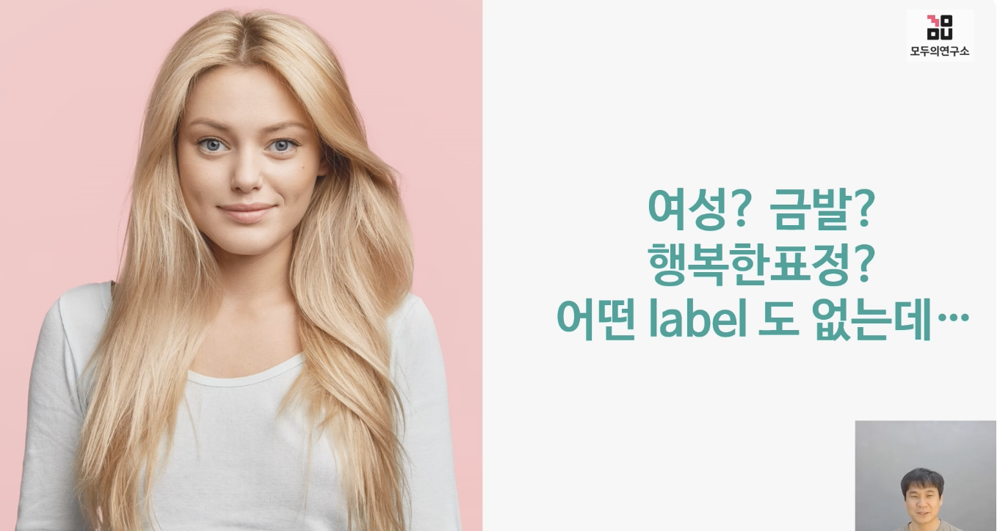
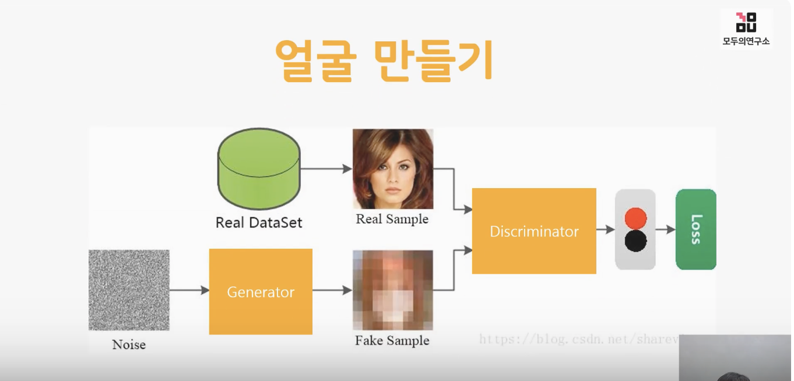
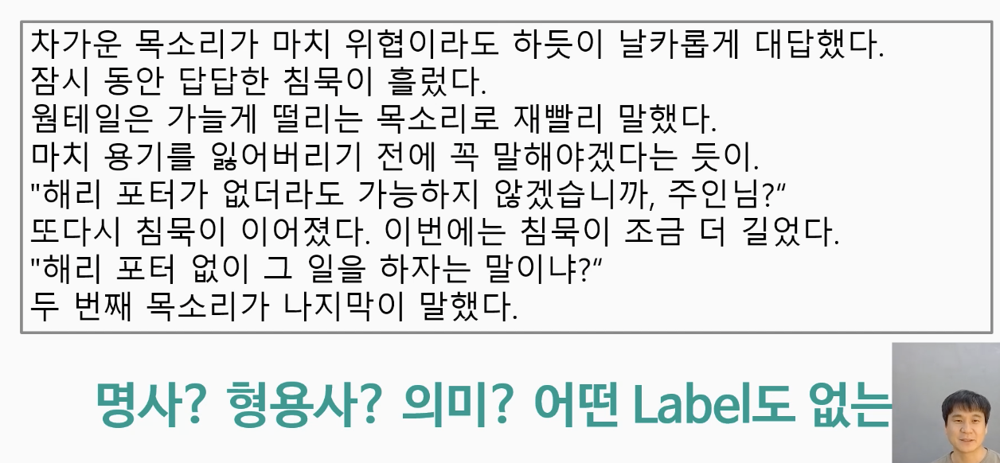
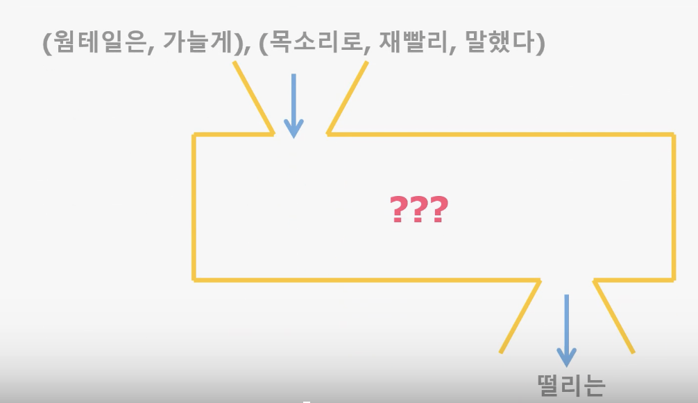
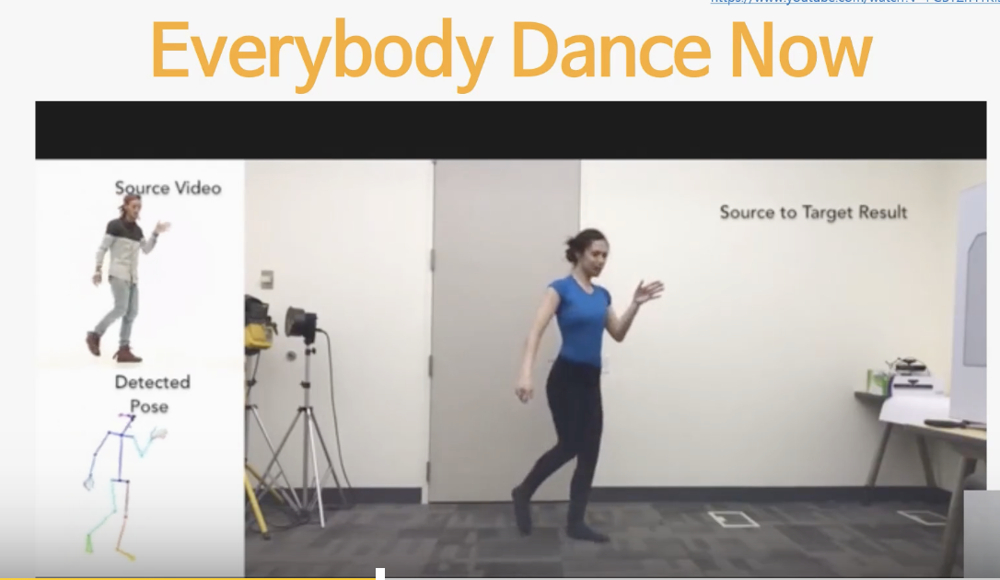
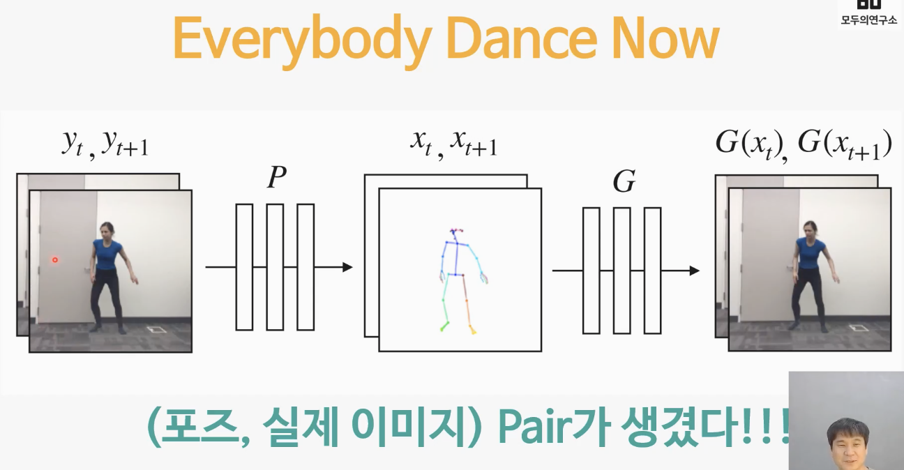

# 5. 의미없는 데이터를 의미있게 만들기

## 5-1. 내 안에 존재하는 paired data  

- 의미없는 데이터를 의미있게 만들기
- 데이터를 가지고 있긴 한데 Paied Data도 아니고 Unpaired Data도 아닌 데이터
- 내 안에 존재하는 Paired Data를 만들어보자(생각을 전환하면 Paired Data가 될 수 있다)

- '이건 진짜 사진에에요' 라는 label이 숨어 있다.

## 5-2. 인공지능으로 얼굴 만들기 generator와 discriminator의 학습

- Generator 인공지능 알고리즘을 만든 뒤, 실제 사진같은 fake 사진을 만들어낸다.
- 화이트 노이즈는 모든 주파수 성분을 다 가지고 있는 노이즈를 화이트노이즈라 말한다.
- 화이트 노이즈는 정보량이 굉장히 많은 데이터이며 이를 이용하여 조각하듯이 깍아 나가며 사람처럼 만들 수 있다.
- Discriminator는 진짜 사진과 가짜 사진을 구분하는 인공지능 알고리즘이다.
- generator와 discriminator를 계속해서 학습시키면 진짜 사람 얼굴같아지게 만들수 있다.
- 이러한 기술을 GAN(Generative Adversarial Network)라고 한다.

Q. Generator와 Discriminator의 역할은 무엇인가요?
- Generator: White noise를 입력으로 받아 Discriminator를 속일 정도의 좋은 영상/사진을 만듭니다.
- Discriminator: 진짜와 가짜를 판별합니다.

## 5-3. 텍스트 분석을 위한 데이터 변환

- 이런 소설 속에서도 paired data를 만들 수 있다.
- 웜테일은 가늘게 (    ) 목소리로 재빨리 말했다. 

- 출력데이터가 원래는 없었으나 블랭크를 만들면서 paired data를 만들 수 있다.
- 이렇게 ???모양의 함수를 language model이라고 한다.
- 이렇게 paired data를 만들어서 학습시키면 어떤 문장이 나올지 예측할 수 있다.  

Q. ‘웜테일은 가늘게 ( ) 목소리로 재빨리 말했다’와 같이 맞출 단어에 마스크를 씌우고, 마스크의 위치를 변경하면서 학습시키는 모델은 무엇인가요?
- 언어 모델(language model). 언어 모델은 앞뒤로 단어가 있을 때 가운데 단어를 맞추는 모델입니다.

## 5-4. 언어모델 활용해 보기

- 언어모델 소개
- 위에 소개한 두 사례에서 GPT, BERT와 같은 딥러닝 모델 이름이 언급되고 있습니다. 이들은 딥러닝으로 구현된 '언어 모델'의 가장 대표적인 것들입니다.

- CASE 1. GPT : 다음 문장에 이어질 단어는 무엇일까요?

  - 사람처럼 유창한 글을 쓰는 것으로 널리 알려진 GPT 모델은 텍스트 생성 모델 중 가장 대표적인 것입니다. 이 모델의 학습 데이터는 주어진 문장 다음에 오기에 가장 적당한 단어를 맞추는 방식으로 구성됩니다.

  - 웜테일은 가늘게 떨리는 목소리로 재빨리 ________.

- CASE 2. BERT : 다음 빈칸에 알맞은 단어는 무엇일까요?

  - BERT는 텍스트의 의미를 정확하게 분석하는 작업에 널리 활용되는 가장 대표적인 언어 모델입니다. 이 모델의 학습 데이터는 텍스트에서 중간 위치를 빈칸으로 가려놓고 그게 무엇인지 맞추는 방식으로 구성됩니다.

  - 웜테일은 가늘게 ________ 목소리로 재빨리 말했다.

Hugging Face를 이용한 GPT 모델 실습

- 데모 실습에는 GPT-2 모델이 사용되었고 mc4라는 웹크롤링을 통해 얻은 데이터셋이 활용되었다.

## 5-5. paired data를 만들어보자 Everybody Dance Now로 도출하는 데이터

- 겉으론 안보이지만 paired data인 것은 무엇이 있을까?
- Everybody Dance Now라는 논문에서는 paired data를 만들어서 학습시킨다.
- 내가 춤을 잘 못춰도 paired data를 만들어서 학습시키면 내가 춤을 잘추는 것처럼 보이게 만들 수 있다.

- 영상 정보 데이터를 가지고 pose estimation을 한다.
- 가운데 스켈레톤 정보는 supervised learning을 통해 학습시킨다.
- 스켈레톤 정보로 부터 G(제네레이터)를 통해 사람과 합성한다.
- 처음에 일반인의 움직임을 바탕으로 마지막 사진은 정답데이터를 다 가지고 있다.
- 스켈레톤 정보에 진짜 Dancer의 정보만 준다면 Dancer가 추는것처럼 합성할 수 있다. 
- (포즈, 실제 이미지) pair가 생겼다.
- 원래는 보이지 않는 데이터였지만 pose 데이터와 실제 이미지 data를 합성해서 paired data를 만들어 냈다.

Q. Everybody Dance now로 paired data를 도출하는 방법을 설명해 보세요.
- 일반인의 영상으로부터 포즈 정보를 뽑아냅니다. (포즈 정보는 오픈 코드를 이용해 supervised learning 방식으로 쉽게 만들 수 있습니다.)
만들어진 포즈 정보 혹은 스켈레톤 정보로부터 Generator가 영상을 만듭니다. 이 때, 만들어진 영상은 원래의 영상과 같은 영상입니다.
스켈레톤 정보만 주면 (일반인의) 영상을 만들도록 Generator를 학습시킵니다.
댄서의 영상에서 추출한 스켈레톤 정보를 이용해 Generator가 (일반인의) 영상을 만듭니다. (댄서의 영상에서 추출한 스켈레톤 정보와 일반인의 영상을 합성시킵니다.)
결국 포즈와 실제 이미지의 pair가 생깁니다.

