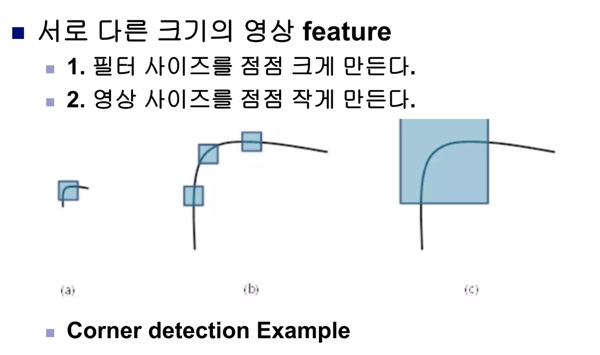

# 6. Convolution을 알아보자!

## 6-1. Convolution? Convolution!
 - CNN(Convolutional Neural Network) 또는 합성곱 신경망을 학습

- Neural Network를 영상처리에 특화시켜보자 -> CNN
- Convolution(Operator:연산자)이란?
  - 이미지의 특징을 추출하는 역할 
  - 4칙연산이 있었듯 Convolution은 5칙연산이라 생각하면 됨
  - [2 3]*[1 1] = [2 5 3]
Q. Convolution은 +, x, shift의 조합으로 된 복잡한 연산입니다. [1 2 3] * [1 1 1]의 값은 무엇인가요?
- [1 2 3] * [1 1 1] = [1 3 6 5 3]  

  

## 6-2. 영상에서의 convolution_mask 이해하기
- 영상에서의 convolution_mask는 어떻게 적용되는가?  

## 6-3. 영상에서의 convolution_스스로 해보기
- 영상에서 convolution한다는 것은 그 영상에서 특징을 추출한다는 것을 의미한다.
- 마스크 설계에 따라서 특징이 되는 선을 찾아준다

Convolution의 연산자의 특징
- (f*g)(h) = f*(g*h) : 결합법칙이 성립한다
- ex) f : 입력영상, g : R/G 통과 필터, h : R 통과 필터 
- 좌변에서 입력영상에 g를 통과시키면 빨간색과 녹색만 있는 이미지가 나오고 h를 통과시면 빨간색만 있는 이미지가 나완다
- 우변에서는 g와 h를 먼저 연산하면 빨간색만 있는 이미지가 나오고 이 이미지에 f를 통과시키면 빨간색만 있는 이미지가 나온다.

## 6-4. 영상 분석의 기초
- 서로 다른 크기의 영상 feature가 필요하다.

- 영상 분석의 기초는 영상의 특징을 추출하는 것이다.
- 영상은 작은 꼭짓점부터 큰 꼭짓점까지 다양하다. 작은 꼭짓점을 찾을때는 작은 마스크로, 큰 꼭짓점을 찾을 때는 큰 마스크를 사용하면 찾을 수 있다
- 우리는 컨볼루션을 통해서 영상의 특징을 뽑아내기는 하는데 서로 다른 크기의 영상을 뽑아내는 방법이 필요하다.

## 6-5. 서로 다른 크기의 feature 만들기
- 서로 다른 크기의 영상 feature를 만드는 두가지 방법
- 1. 필터 사이즈를 점점 크게 만들면서 영상을 통과시키는 방법
- 2. 영상 사이즈를 점점 작게 만든다
- 이 두가지를 모두 넣은것이 Convolution Neural Network이다.

** CNN에서 이미지를 분석하려면, 이미지를 여러 개의 작은 "이미지 패치"로 나누어야합니다. 각 이미지 패치를 따로따로 분석하고 그 결과를 조합하여 전체 이미지를 분석하는 것이 일반적입니다. 다양한 크기의 이미지가 있을 경우, 다양한 크기의 이미지 패치를 추출하는 것이 더 효과적입니다. 이것은 이미지에서 다양한 크기의 객체를 처리하는 데 도움이 됩니다. 또한, 작은 객체가 있을 때 작은 이미지 패치를 사용하고 큰 객체가 있을 때는 더 큰 이미지 패치를 사용하여 객체를 더 정확하게 식별할 수 있습니다. 따라서, 서로 다른 크기의 feature를 학습하면 이미지 분석이 더욱 정확해지고 다양한 크기의 객체를 처리할 수 있게 됩니다. **
