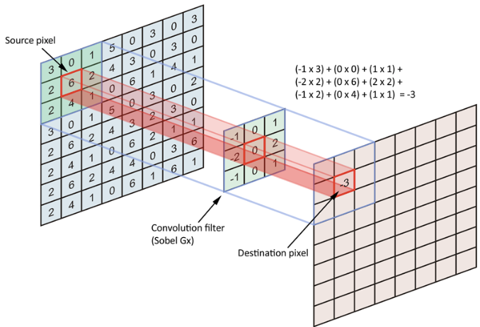

# 6. Convolution을 알아보자!

## 6-1. Convolution? Convolution!
 - CNN(Convolutional Neural Network) 또는 합성곱 신경망을 학습

- Neural Network를 영상처리에 특화시켜보자 -> CNN
- Convolution(Operator:연산자)이란?
  - 이미지의 특징을 추출하는 역할 
  - 4칙연산이 있었듯 Convolution은 5칙연산이라 생각하면 됨
  - [2 3]*[1 1] = [2 5 3]
Q. Convolution은 +, x, shift의 조합으로 된 복잡한 연산입니다. [1 2 3] * [1 1 1]의 값은 무엇인가요?
- [1 2 3] * [1 1 1] = [1 3 6 5 3]  

  

## 6-2. 영상에서의 convolution_mask 이해하기
- 영상에서의 convolution_mask는 어떻게 적용되는가?  

