# 9. RNN 수학적으로 이해하기

## 9-1. RNN 수학적 이해

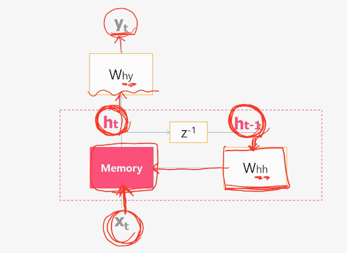

- Whh : 이전 시점의 은닉 상태를 현재 시점의 은닉 상태로 만드는 가중치, 앞의 첨자 h 는 ht-1을 의미
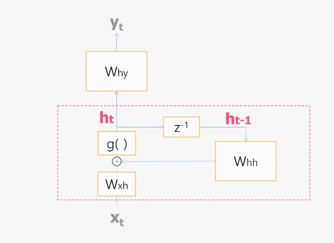

- Wxh : 입력값을 은닉 상태로 만드는 가중치, 앞의 첨자 x 는 xt를 의미
- Wyh : 은닉 상태를 출력값으로 만드는 가중치, 앞의 첨자 y 는 yt를 의미
- g : non-linear activation function(활성화함수)를 한번 통과시켜서 메모리값을 만들어 냄
- 비선형 함수는 입력과 출력 사이 관계가 직선이 아닌 함수

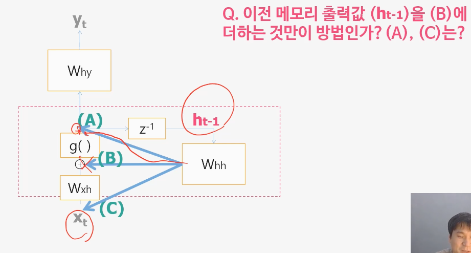
- 활성화 함수 전/후 혹은 네트워크 전에 이전 메모리값을 더해주는 것을 RNN을 만든 사람은 B에다 더함

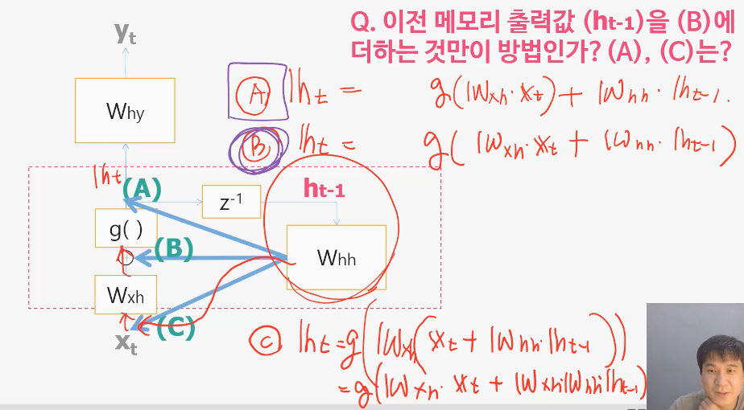
- A의 경우 B에 비해서 뒷쪽부분이 non-linear activation function을 통과하지 않아 A의 경우는 사용하지 않음
- C의 경우 과거의 과거의 메모리 입력값에 네트워킹을 한번 통과시키느냐 두번 통과시키느냐의 차이. 두번 통과하는것은 불필요하고 비효율적
- 메트릭스를 한번 학습시키는것이 더 효율적이라고 판단하여 B가 더 유리할 것으로 판단됨

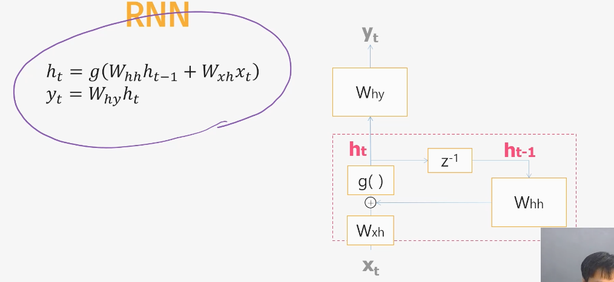

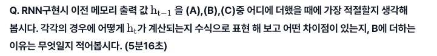
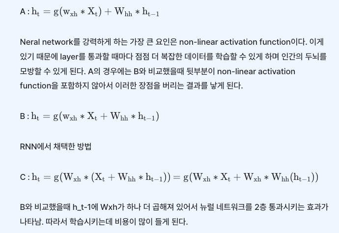

## 9-2. LSTM을 이해하자!
- 기본 형태의 RNN은 순환(recurrent) 의 구조로 순서가 있는 데이터, 시계열 데이터 등을 처리할 수 있지만
- 은닉층(layer)이 많아질수록 기울기가 상실되는 문제가 발생하여 정확한 출력값을 도출하지 못하는 문제가 발생합니다.
- 이를 보완하기 위해 등장한 딥러닝 알고리즘이 바로 LSTM(Long Short-Term Memory) 입니다.

LSTM을 이해하자!
- Vanishing Gradient Problem 복습
- 레이어를 많이 쌓으면 많이쌓을수록 좋지만 함부로 쌓을수 없는 이유
- 학습되는 양 = 미분값 * 출력값
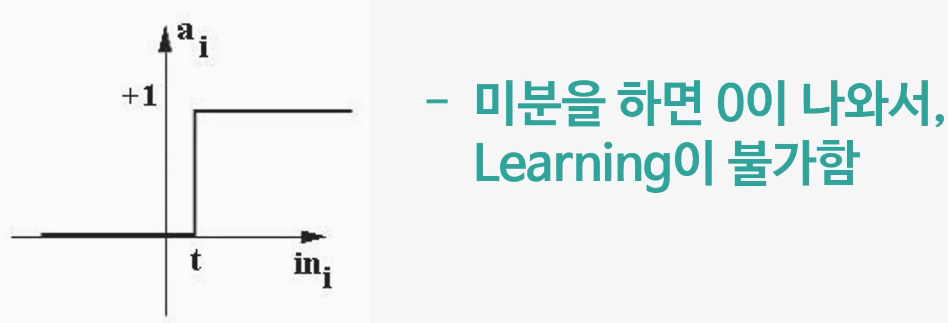
- 대부분의 영역에서 미분값이 0에 가깝다
- 출력의 최대값이 1이다. 출력값이 0.5라고 했을때 4개의 레이어만 지나도 1/16이 되어버린다.
- 레이어를 지나면 지날수록 0에 가까워 지는 vanishing gradient problem이 발생한다.
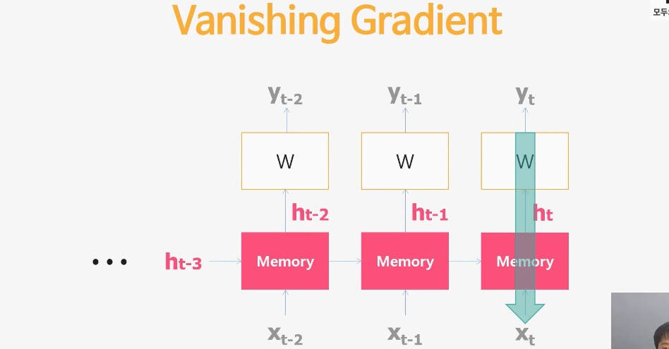
- 레이어는 세로축을 의미. 
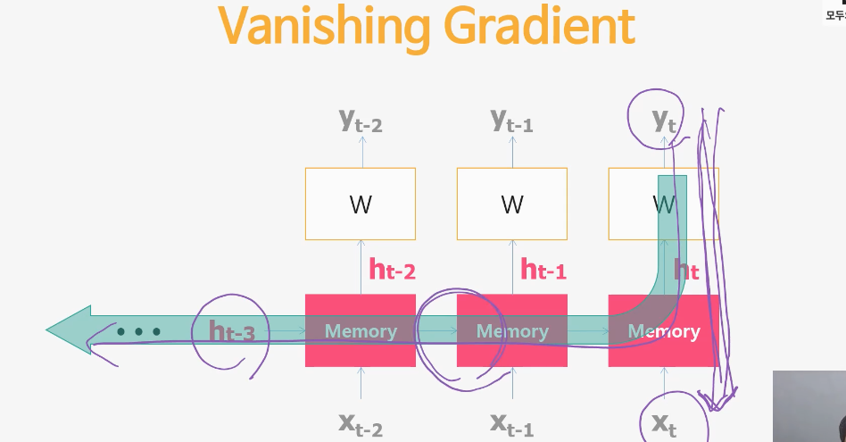
- RNN은 화살표 방향으로 타고 오면 이전메모리와 그다음메모리까지 레이어가 더 많이 진다.
- 이러한 문제를 해결하고자 나온것이 LSTM
- LSTM은 평균을 구하는 것에서 시작한다.
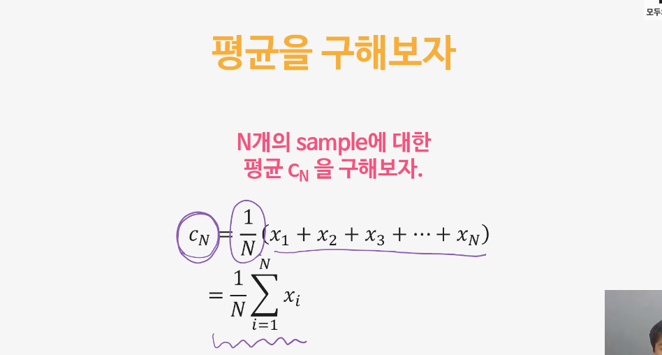
- 평균을 구하는 또 다른 방법
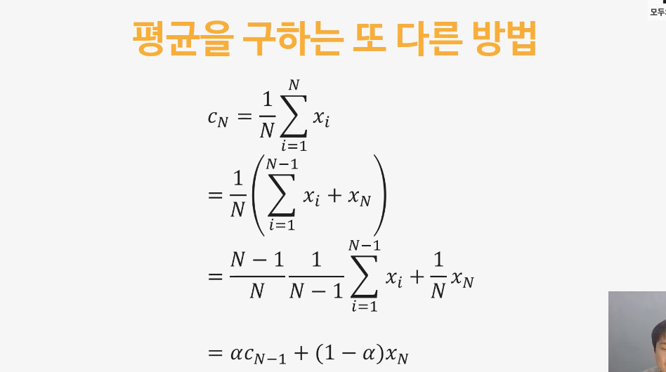
- 마지막 n번째 레이어의 출력값을 더해주는 방법
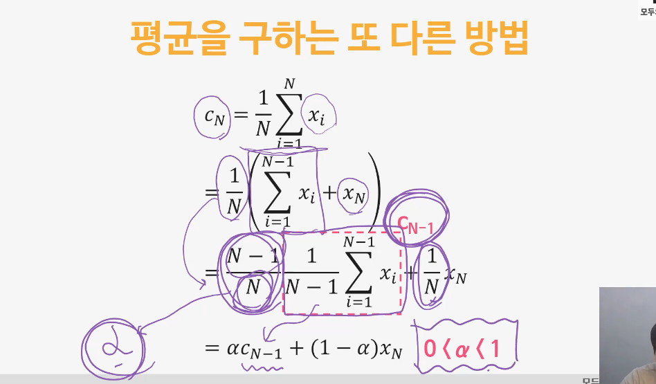
- 알파=(N-1)/N 이라고 하면 1/N = 1-알파 가 되고 알파는 0~1사이의 값을 가진다
- 이 평균을 이용해서 잘 버무린 메모리를 만들어 보자.

- RNN의 메모리 평균을 Ct를 이용해보자
- 평균은 이전 평균*알파 + 새로들어오는 입력*(1-알파)
- 알파와 1-알파는 사람이 수식적으로 구해준 것이고 Neural Network에 넣어서 학습시키면 알아서 최적의 알파값을 찾아준다.

- 얼마만큼 forget하고 얼마만큼 input을 받아들일 것인가?
- forget gate와 input gate를 만들어서 이를 학습시키는 것이 LSTM의 핵심
- f값이 0.9라는 의미는 0.9만큼의 메모리를 유지하고 0.1만큼의 메모리를 버린다는 의미
- i값이 0.1이라는 의미는 0.1만큼의 메모리를 새로 받아들인다는 의미
- 얼마만큼 forget하고 얼마만큼 input을 받아들일 것인지는 또 다른 Neural Network를 통해 학습시킨다.
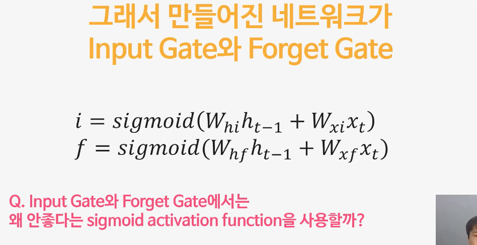
- i와 f는 사실 g값을 제외하면 RNN과 동일한 구조
- sigmoid 함수는 vanishing gradient problem에 취약하여 별로 좋지 않지만 0에서 1사이의 값을 가지기 때문에 forget gate와 input gate를 만들기에 적합하다.  

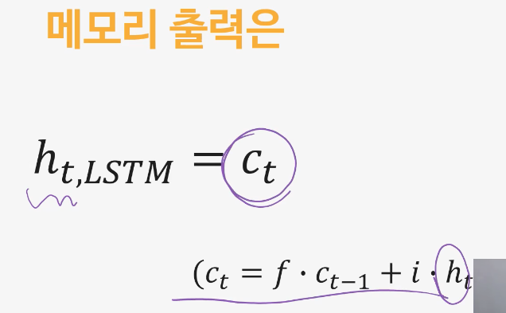  

- LSTM에서는 ht의 평균값 Ct를 사용한다.  

  

- 평균을 구한뒤 한번 더 output gate를 통과시켜서 최종적인 출력값을 만들어 낸다.  

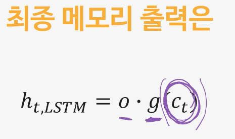  

- 최종 메모리 출력은 평균값에 Non-linear activation 값을 곱하고 output gate를 곱해서 최종 메모리 값으로 사용

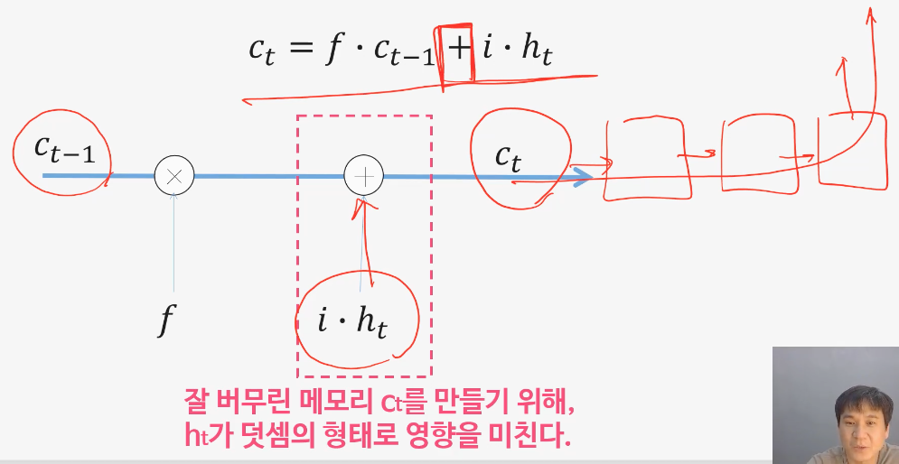  

- Ct를 만들기 위해 ht가 덧셈의 형태로 영향을 미치기 때문에 기존 곱셈으로 이루어진 일반적인 RNN보다 더욱 더 미분값이 0에 가까워지는 문제를 해결할 수 있다.

Q. LSTM의 Input Gate와 Forget Gate에서는 왜 relu를 쓰지 않고 sigmoid activation function을 사용할까요?
α와 1-α 가 0과 1 사이의 값 이여야 한다는 사실을 만족 시키기 위해서 입니다. sigmoid함수의 출력은 항상 0과1사이의 값을 가지기 때문에 이를 만족시킵니다.
Relu 함수는 값의 범위가 0 이상인 값이기 때문에 forget gate와 input gate가 판단해야 하는 정보의 중요도와는 별개로 곧바로 1의 값을 가지는 문제점이 있습니다.  

**relu 함수란? : relu 함수는 입력값이 0보다 작으면 0을 출력하고 0보다 크면 입력값을 그대로 출력하는 함수입니다.**

Q. LSTM이 vanishing gradient problem에 강한 이유는 무엇인가요?
- Ct를 만들기 위해 ht가 덧셈의 형태로 영향을 미치기 때문에 기존 곱셈으로 이루어진 일반적인 RNN보다 더욱 더 미분값이 0에 가까워지는 문제를 해결할 수 있다.

-end-
