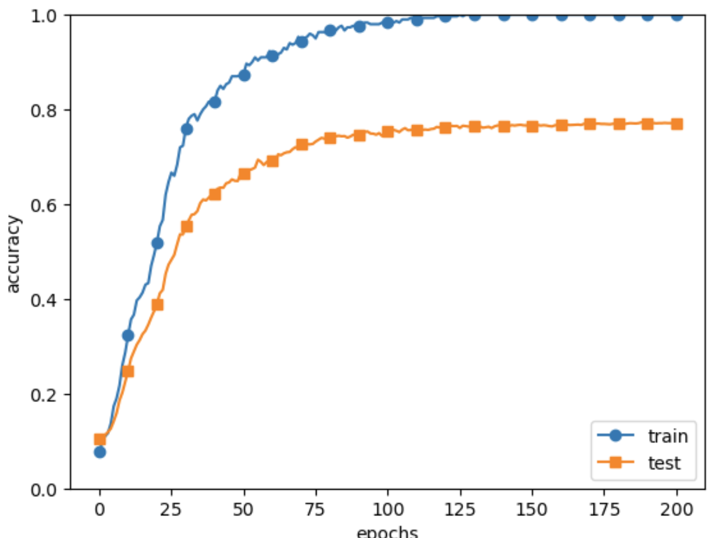
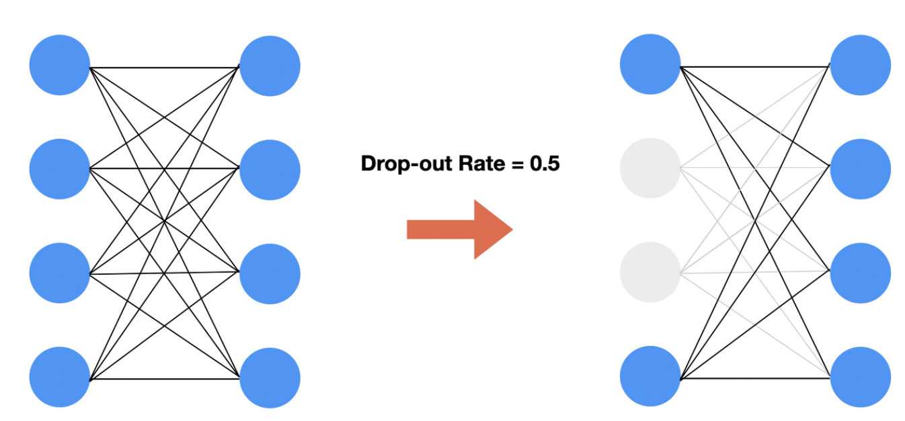
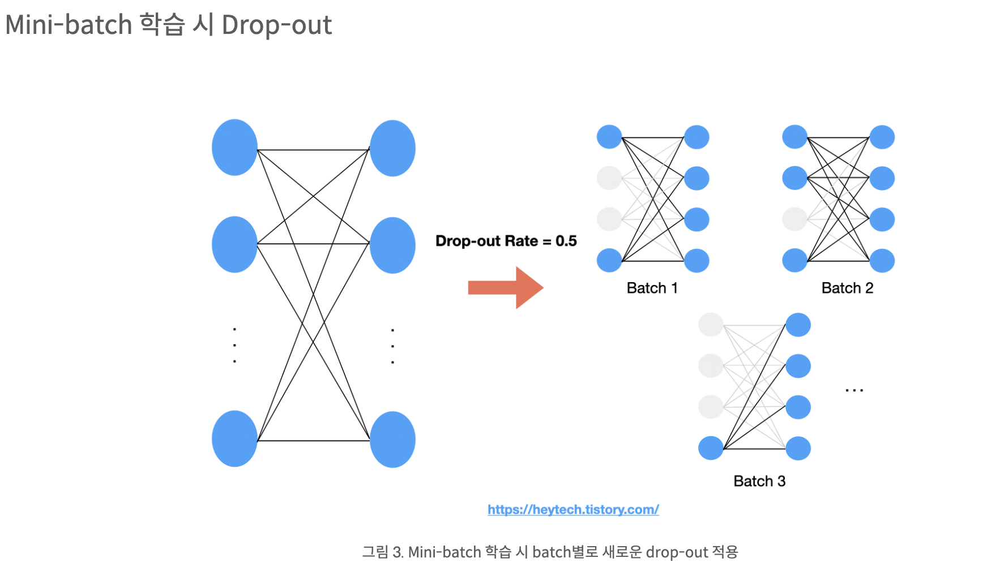
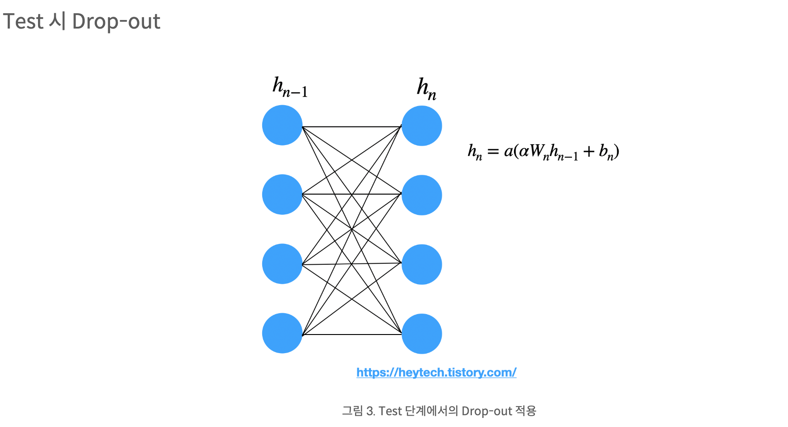
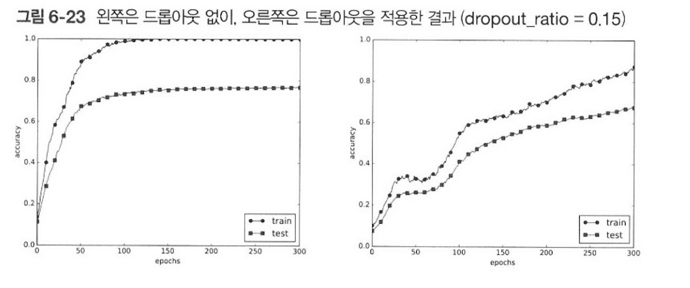
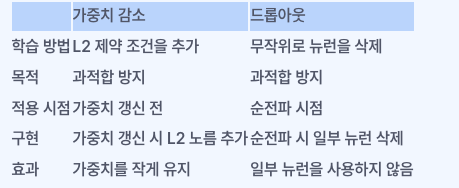
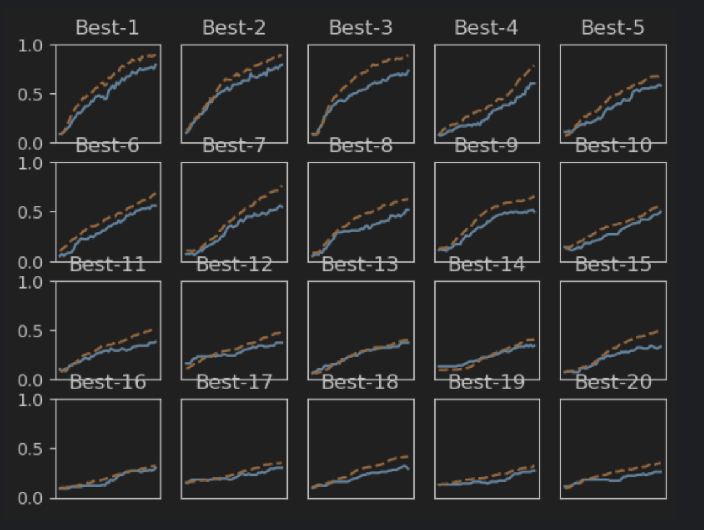
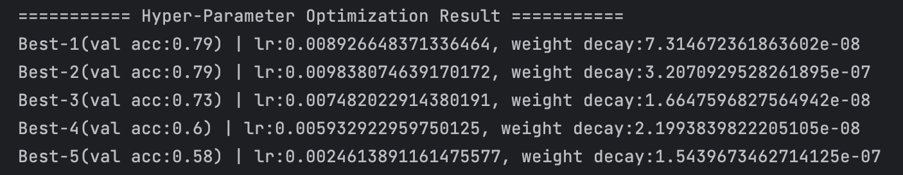

#  밑바닥부터 시작하는 딥러닝

#  Deep Learning from Scratch

# 6-4, 6-5


---

## 6.4 바른 학습을 위해

오버피팅: 신경망의 훈련 데이터에만 지나치게 적응되어 

그 외의 데이터에 제대로 대응하지 못하는 상태

### 6.4.1 오버피팅

오버피팅이 발생하는 경우
* 매개변수가 많고 표현력이 높은 모델 (신경망 모델의 표현력은, 해당 모델이 학습 데이터를 얼마나 정확하게 나타낼 수 있는지를 나타내는 지표입니다. 일반적으로, 표현력이 높은 모델은 더 복잡한 함수를 표현할 수 있으므로, 더 정확한 예측 결과를 가져올 수 있습니다. 하지만, 매개변수 수가 많은 모델에서는 이러한 표현력이 오버피팅을 유발하는 가능성을 높일 수 있습니다. 따라서, 표현력과 오버피팅 사이의 균형을 잡는 것이 중요합니다.)
* 훈련 데이터가 적음
* 오버피팅 완화 기법으로는 가중치 감소와 드롭아웃이 있다

---
case 3.1 오버피팅이 발생하는 MNIST 신경망 구성 구현 코드(300장 데이터 7층망)



정확도가 크게 벌어지는 것은 훈련 데이터에만 적응(fitting)한 결과

훈련때 사용하지 않은 범용 데이터(시험데이터)에는 제대로 대응하지 못하는 것을 확인

---
### 6.4.2 가중치 감소

가중치 감소(weight decay)

학습 과정에서 큰 가중치에 대해서는 그에 상응하는 큰 패널티를 부과하여 오버피팅을 억제하는 방법

가중치의 제곱노름을 손실함수에 더하면 가중치가 커지는 것을 억제

신경망 학습의 목적은 손실함수의 값을 줄이는것.

가중치를 W라 하면 L2 노름 법칙에 따른 가중치 감소는 1/2 λ (W**2) 가 되고 이 값을 손실함수에 더함

---

$$\begin{equation*}
L =  \sum t_{k} log y_{k} + \frac{1}{2} \lambda W^{2}
\end{equation*}$$  
                           <손실함수 중 교차엔트로피를 이용한 예시>

λ(람다)는 정규화의 세기를 조절하는 하이퍼파라미터. 이 값을 크게 설정할 수록 큰 가중치에 대한 패널티가 커짐

따라서 가중치의 기울기를 구하는 계산에서는 그동안의 오차역전파법에 따른 결과에 정규화 항을 미분한 λW를 더함

1/2 λ (W**2)의 앞쪽 1/2은 1/2 λ (W**2)의 미분결과인 λW를 조정하는 상수의 역할(역전파때 자기 값을 돌려줌)

---
참고. L2 노름이란?

가중치 감소(Weight decay)는 오버피팅을 방지하기 위한 방법 중 하나로, 손실 함수에 가중치의 크기에 대한 패널티를 추가하여 가중치의 크기가 작아지도록 합니다. 이때, 가중치의 크기 측정 방법으로 사용되는 함수가 L2 노름입니다. L2 노름은 가중치의 제곱합을 계산한 후 그 제곱근을 구하는 방법으로 가중치의 크기를 측정합니다. 수식으로 표현하면 다음과 같습니다. L2 노름 = √(w₁² + w₂² + w₃² + ... + wᵣ²) 여기서 w는 가중치 벡터이며, r은 가중치의 개수를 의미합니다. 가중치 감소에서는 L2 노름에 비례하는 양만큼의 패널티를 손실 함수에 추가함으로써, 가중치의 크기가 작아지도록 합니다. 이를 통해 모델이 덜 복잡해지고, 일반화 성능이 향상되는 효과를 얻을 수 있습니다.

---
case3.2 가중치 감소(λ=0.1)를 적용한 결과

훈련 데이터에 대한 정확도와 시험 데이터에 대한 정확도 차이는 그림 case 3-1 에 비해 줄었음
오버피팅이 억제됨

---
### 6.4.3 드롭아웃

신경망 모델이 복잡해지면 가중치 감소만으로는 대응하기 어려움

드롭아웃 : 뉴런을 임의로 삭제하면서 학습하는 방법

삭제된 뉴런은 신호를 전달하지 않음

훈련 때에는 데이터를 흘릴 때마다 삭제할 뉴런을 무작위로 선택.




---


Drop-out Rate를 0.5로 설정했기 때문에 뉴런별로 0.5의 확률로 drop 될지 여부가 결정됩니다. 즉, 그림 3처럼 첫 번째 batch에서는 위에서 2, 3번 뉴런이 꺼졌고, 2번째 batch에서는 3번 뉴런 1개만 꺼졌고, 3번째 batch에서는 1, 2, 3번 뉴런 3개가 꺼질 수 있습니다.

---



시험 때에는 모든 뉴런에 신호를 전달. 각 뉴런의 출력에 훈련 때 삭제한 비율을 곱하여 출력.

---
 Drop-out은 어떤 특정한 설명변수 Feature만을 과도하게 집중하여 학습함으로써 발생할 수 있는 과대적합(Overfitting)을 방지하기 위해 사용

역전파 때의 동작은 ReLU와 같음.

순전파때 신호를 통과시키는 뉴런은 역전파때도 신호를 그대로 통과시키고 순전파 때 통과시키지 않은 뉴런은 역전파 때도 신호를 차단.

---


드롭아웃을 적용하니 훈련 데이터와 시험 데이터에 대한 정확도 차이가 줄었음

또한 훈련데이터에 대한 정확도가 100%에 도달하지 않음

드롭아웃을 이용하면 표현력을 높이면서 오버피팅을 억제가능

---

앙상블 학습(ensenble learning)

앙상블 학습은 개별적으로 학습시킨 여러 모델의 출력을 평균내어 추론하는 방식

앙상블 학습은 드롭아웃과 밀접함. 드롭아웃이 학습 때 뉴런을 무작위로 삭제하는 행위를 매번 다른 모델을 학습시키는 것으로 해석

같은 구조의 네트워크를 여러 개 준비하여 따로따로 학습. 여러 개의 출력을 평균내어 답변

드롭아웃은 앙상블 학습과 같은 효과를 (대략) 하나의 네트워크로 구현했다고 볼 수 있음

---

#### 오버피팅을 억제하는 방법

1. 가중치 감소
2. 드롭아웃(신경망이 복잡할 경우)
3. 데이터를 충분히 확보, 모델의 적정성 유지

---



---

## 6.5 적절한 하이퍼파라미터 값 찾기

신경망에는 하이퍼파라미터가 다수 등장한다
  - 각 층의 뉴런수, 배치 크기, 매개변수 갱신 시의 학습률과 가중치 감소 등

이런 값들을 적절히 설정하지 않으면 모델의 성능이 크게 떨어진다

하이퍼파라미터 값을 최대한 효율적으로 탐색하는 방법

---

### 6.5.1 검증 데이터

하이퍼 파라미터 성능을 평가할 때는 시험 데이터를 사용해서는 안됨

* 하이퍼파라미터 값이 시험 데이터에 오버피팅되기 때문
* 하이퍼파라미터 값의 좋음을 시험데이터로 확인하게 되므로 하이퍼파라미터의 값이 시험데이터에만 적합하도록 조정되어 다른 데이터에는 적응하지 못해 범용 성능이 떨어지는 모델이 될 가능성 존재

검증 데이터(validation data) : 하이퍼파라미터 전용 확인 데이터

훈련 데이터 : 매개변수 학습

시험 데이터 : 신경망의 범용 성능 평가

데이터셋에 따라서는 훈련 데이터, 검증 데이터, 시험 데이터를 미리 분리해둔 것도 있음

MNIST 데이터셋에서 검증 데이터를 얻는 가장 간단한 방법은 훈련 데이터 중 20% 정도를 검증 데이터로 먼저 분리

---

```python
from dataset.mnist import load_mnist
from common.util import shuffle_dataset

(x_train, t_train), (x_test, t_test) = load_mnist()

# 훈련 데이터를 뒤섞는다.
x_train, t_train = shuffle_dataset(x_train, t_train)

# 20%를 검증 데이터로 분할
validation_rate = 0.20
validation_num = int(x_train.shape[0] * validation_rate)

x_val = x_train[:validation_num]
t_val = t_train[:validation_num]
x_train = x_train[validation_num:]
t_train = t_train[validation_num:]
```
훈련 데이터를 분리하기 전에 입력 데이터와 정답 레이블을 shuffle_dataset으로 뒤섞음

데이터 셋 안의 데이터가 치우쳐 있을지 모르기 때문

---

### 6.5.2 하이퍼파라미터 최적화

하이퍼파라미터의 최적값이 존재하는 범위를 조금씩 줄여나가는 것이 좋음


* 0단계: 하이퍼파라미터 값의 범위를 설정
* 1단계: 설정된 범위에서 하이퍼파라미터의 값을 무작위로 추출

  -  무작위로 샘플링해 탐색하는 것이 좋은 결과. 최종 정확도에 미치는 영향력이 하이퍼파라미터마다 다르기 때문
  - 10의 계승'단위로 범위를 지정. 로그 스케일(log scale)로 지정.

* 2단계: 1단계에서 샘플링한 하이퍼파라미터 값을 사용하여 학습하고, 정확도를 평가. (에폭은 작게 설정)
* 3단계: 1단계와 2단계를 특정 횟수(100회 등) 반복하며, 그 정확도의 결과를 보고 하이퍼파라미터의 범위를 좁힌다.

---

### 6.5.3 하이퍼파라미터 최적화 구현하기

하이퍼파라미터 검증은 로그 스케일 범위에서 무작위로 추출해 수행

파이썬코드로는 10 \*\* np.random.uniform(-3,3)처럼 작성.

이 예에서는 가중치 감소 계수를 10^-8 ~ 10^-4, 학습률을 10^-6 ~ 10^-2 범위부터 시작.

하이퍼파라미터 무작위 추출코드

```python
weight_decay = 10**np.random.uniform(-8,-4)
lr = 10**np.random.uniform(-6,-2)
```

---




Best-5 정도까지 학습이 순조롭게 진행.


---



결과로 볼 때 학습률은 0.001 ~ 0.01, 가중치 감소 계수는 10^-8 ~ 10^-6 정도임을 알 수 있음.

다음은 축소된 범위로 똑같은 작업을 반복.

범위를 좁혀가다가 특정 단계에서 최종 하이퍼파라미터 값을 하나 선택.